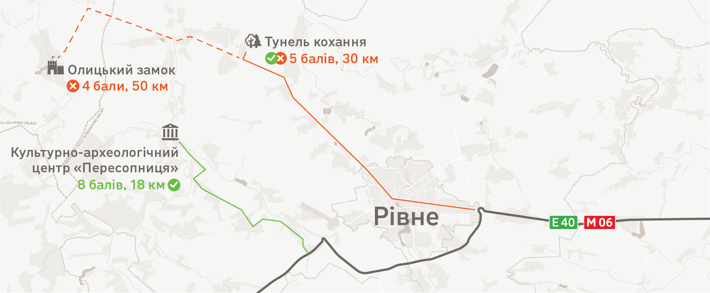
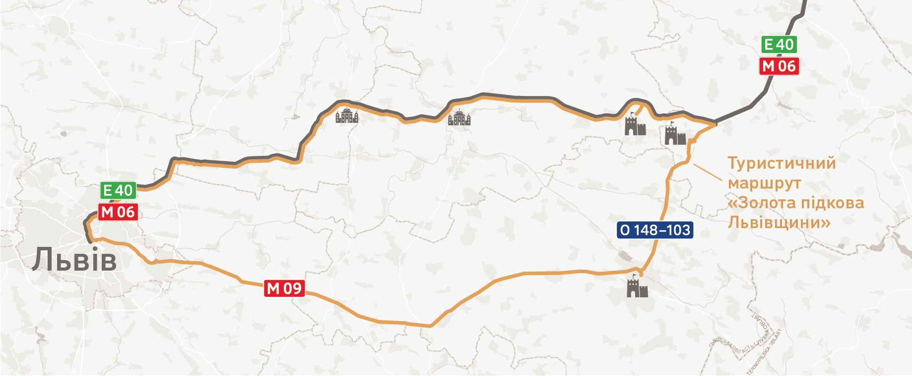
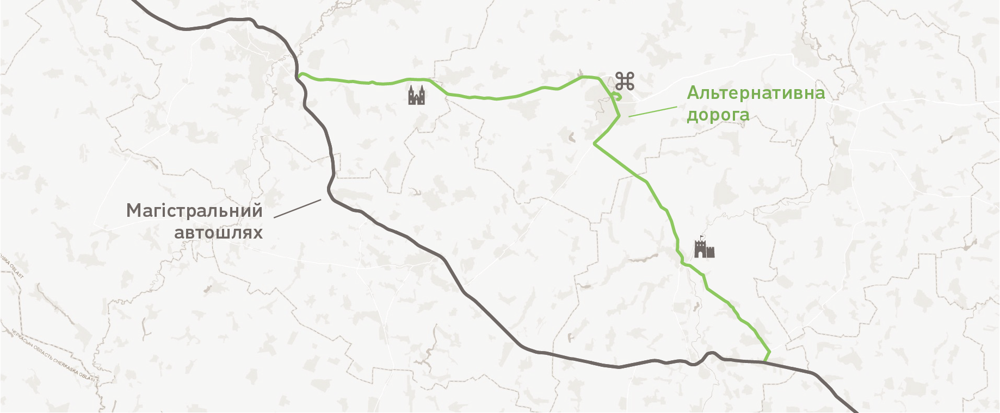

# Розділ 2. Типи об’єктів

Дорожня туристична навігація розповідає та спрямовує до туристичних об’єктів трьох типів:
* точка інтересу;
* туристичний маршрут;
* туристичний населений пункт.

Окремо також виділяємо сервіси, але розповідаємо про них лише у зв’язці з певними точками інтересу.

## 2.1 Точка інтересу

2.1.1 Точкою інтересу ми вважаємо окремий об’єкт (замок, озеро, парк тощо), компактно локалізований комплекс об’єктів (історичний центр міста) чи визначну локацію без явно видимого об’єкта (місце історичних подій, городище тощо).

2.1.2 Категорії точок інтересу. Щоб мати можливість ознаковувати точки інтересу впізнаваними піктограмами, ми розділили їх на 22 категорії. Кожна категорія має власну піктограму. Списки можливих об’єктів, що наведено нижче, не є вичерпними — на знаках можуть можуть відображатися й інші об’єкти з кожної категорії, якщо вони цікаві туристам.

Ремеслене та локальне виробництво
До цієї групи ми відносимо ті об’єкти виробництва, що можуть зацікавити туристів. Для цього вони повинні бути відкритими до відвідування й мати інформаційний центр або ними проводяться екскурсії. Сюди, наприклад, можна віднести:
– виноробні,
– ручне виробництво,
– ферми,
– пивоварні,
– сироварні,
– пасіки та інші об’єкти бджільництва.

Меморіальні кладовища
До цієї групи відносимо місця поховання, що мають високу історичну або культурну значущість: – військові кладовища,
– цивільні кладовища,
– кладовища окремих релігійних конфесій.

Торгівля
До цієї групи відносимо об’єкти прямої торгівлі, що цікаві туристам для відвідування:
– ринок матеріальних об’єктів місцевого виробництва,
– ринок продуктів харчування місцевого виробництва, – ринок сувенірів.

Місця пам’яті
Місця символічних об’єктів, з якими певна група людей пов’язує свої спогади чи цінності:
– пам’ятники та меморіали,
– місця військових дій,
– місця історичних подій.

Археологічні пам’ятки
Місця важливих археологічних знахідок:
– городища,
– стоянки,
– вали,
– окремі артефакти.

Рекреація на снігу
Привабливі для туристів місця відпочинку та рекреації на снігу:
– окремі лижні витяги,
– гірськолижні курорти,
– лижні маршрути.

Культурні заклади
– Музеї,
– галереї,
– театри,
– цирки,
– кінотеатри.

Католицькі та протестантські релігійні споруди
– Костели, римо-католицькі храми,
– греко-католицькі храми,
– кірхи, протестантські храми,
– римо-католицькі монастирі,
– греко-католицькі монастирі,
– дзвіниці.

Ісламські релігійні споруди
До цієї групи відносимо ісламські релігійни споруди, що мають високу історичну, культурну або архітектурну значущість.
– Мечеть.

Рекреація на воді
Привабливі для туристів місця контакту з водою:
– облаштовані місця риболовлі, – пляжі та облаштовані місця для купання,
– пункти рафтингу та каякінгу, – яхт-клуби і марини.

Рекреація на землі
Місця для активного проведення часу на землі:
– пішохідні маршрути,
– велосипедні маршрути,
– місця скелелазіння, 
– кінні маршрути,
– іподроми та манежі.

Православні релігійні споруди
До цієї та наступних категорій релігійних споруд відносимо ті, що можуть бути цікавими для відвідування широкому колу туристів:
– православні храми,
– православні монастирі, 
– дзвіниці.

Юдейські релігійні споруди
– Синагоги, 
– кенаси.

Промислові споруди
На знаках ми відображаємо ті споруди, що мають знакову архітектуру або інженерні і конструктивні рішення, ілюструють типові рішення своєї епохи, зберегли хоча б часткову цілісність та впізнаваність.
– Вітряки,
– водяні млини,
– знакова промислова архітектура,
– знакові інженерні споруди, 
– греблі,
– шахти і відкриті кар’єри,
– мости і віадуки.

Цивільні будівлі
– Палаци,
– садиби, окремі історичні будинки,
– старе місто, історична забудова, 
– маяки.

Розваги
– Тематичні парки,
– парки атракціонів,
– аквапарки,
– зіп-лайни,
– банджі-джампінг,
– польоти на повітряних кулях, 
– вузькоколійні залізниці.

Пам’ятки фауни
– Зоопарки та звіринці, 
– звірі в дикій природі.

Водні пам’ятки
– Озера, ставки та затоплені кар’єри,
– джерела,
– гейзери,
– водоспади та пороги.

Військові будівлі
– Замки та форти, 
– мури,
– башти,
– казарми.

Пам’ятки флори
– Міські парки та сади, 
– дендропарки,
– ботанічні сади,
– лісопарки,
– нацпарки та заповідники.

Земельні пам’ятки
– Гори, вершини, пагорби, 
– скельні масиви та виходи породи, 
– печери, 
– пустелі.

Оглядова точка
До оглядових точок відносимо місця з гарним краєвидом або ж видом на інші пам’ятки.

2.1.3 У Додаток А. Піктограми наведено всі піктограми, що ми розробили на момент публікації поточної версії путівника. Для ознакування певної точки інтересу використовують специфічну піктограму (за наявності в Додаток А. Піктограми) або ж загальну піктограму категорії, до якої ця точка належить.

2.1.4 Якщо точку інтересу важко віднести до до якоїсь з цих категорій, використовують найбільш загальну піктограму «Точка інтересу».

2.1.5 Якщо певну точку інтересу можна віднести до декількох категорій, потрібно визначити її першочергове значення, яке об’єднує чи підпорядковує всі інші. Так, наприклад, у міському парку можуть бути парк скульптур та атракціони. У такому разі основною буде піктограма міського парку, оскільки функція міського парку є контейнером для інших функцій. Піктограми його складових частин — внутрішніх або дотичних точок інтересу — ми відображаємо на другому рівні (див. Розділ 7. Побудова знаків). Так само, якщо посеред фортифікаційної споруди розміщено палац, ми вважаємо його насамперед фортом і використовуємо відповідну піктограму.

2.1.6 Критерії відбору точок інтересу для знаків. Керуючись принципом адекватності, проєктувальник має співвідносити значущість кожної точки інтересу з відстанню, яку потрібно подолати для її відвідування, з’їхавши з поточного маршруту. Для цього використовують систему з 12-ти критеріїв.

> Принцип адекватності: «Ми надаємо інформацію на дорозі лише про ті об’єкти, значущість яких адекватна відстані, яку потрібно подолати для відвідування.»

Об’єкт занесено в один з державних реєстрів
Об’єкт або його складова частина перебуває в одному з державних реєстрів.
Державний реєстр нерухомих пам'яток України (https://mkip.gov.ua/content/derzhavniy-reestr-neruhomih-pamyatok-ukraini.html).
Список пам'яток архітектури Української РСР, що перебувають під охороною держави (https://zakon.rada.gov.ua/laws/show/970-63-%D0%BF#Text).
Музеї, заповідники, заклади музейного типу. Актуальний список закладів можна отримати за запитом до Мінкульту: zapyty@mkip.gov.ua
Для точок інтересу з груп «Пам'ятки флори» та «Пам'ятки фауни», «Водні пам'ятки» та «Земельні пам'ятки» також потрібно враховувати Перелік об'єктів природно-заповідного фонду України (https://pzf.land.kiev.ua/pzf-spisok.html)

Об’єкт має державне або національне значення
В одному з державних реєстрів, наведених вище, об’єкт має статус державного або національного значення. Або ж заклад демонструє один з унікальних музейних предметів (https://data.gov.ua/dataset/014aba3a-63ed-4edf-b6b1-b26f1ad29953).
Також цьому критерію відповідають об’єкти Всесвітньої спадщини ЮНЕСКО (https://unesco.mfa.gov.ua/spivrobitnictvo/ukrayinski-obyekti-u-spisku-vsesvitnoyi-spadshchini-yunesko).
Об’єкт використовується
Існує певна організація, яка використовує цей об’єкт за первинним або іншим призначенням.
Об’єкт зберіг первинну функцію
Об’єкт використовують за тим самим призначенням, за яким його було спроєктовано та побудовано. Або ж це призначення хоча би частково музеїфіковано (наприклад, замок, що перетворили на музей, який розповідає його історію).
Збережені природні об’єкти автоматично відповідають цьому критерію.
Відкритий до відвідування
Об’єкт відкрито для туристів і його можна відвідати без попереднього запису чи домовленостей, спеціальної перепустки чи дозволу.
Об’єкт має інформаційний центр
Є офіційне місце, де турист може отримати вичерпну інформацію про цей об’єкт. Або ж тут офіційно проводять екскурсії.
Збережена цілісність об’єкта
Для будівель: збережена (або відновлена) структурна цілісність фасадів, перекриття між поверхами, даху.
Для природних об’єктів: не захаращені сторонніми об’єктами, не засипані шаром землі або сміття.
Наявна супутня інфраструктура
Туристи мають можливість переночувати і поїсти в радіусі двох кілометрів від об’єкта: наявні щонайменше один готель та кафе або ресторан.
Об’єкт пропонує різні види активностей та інтересу
Туристам на об’єкті доступні щонайменше три види активностей (різні види рекреації та активного відпочинку, споглядання, різні розваги тощо) або об’єкт задовольняє щонайменше три зони інтересу (архітектура, культура, історія, природознавство, контакт з природою тощо).
Наявні дві або більше точок інтересу поруч з об’єктом
Туристам доступно не менше двох інших значущих точок інтересу в радіусі двох кілометрів від об’єкта.
Об’єкт представлено в основних онлайн-путівниках
Туристи можуть знайти інформацію про об’єкт в путівниках «Мандруй Україною» або Discover.ua.
Об’єкт безпосередньо пов’язано з об’єктами нематеріальної культурної спадщини
Об’єкт демонструє, продукує або його історично пов’язано з об’єктами нематеріальної культурної спадщини (https://uccs.org.ua/natsionalnyj-reiestr-obiektiv/)

2.1.7 Оцінка максимальної відстані. Щоби зрозуміти, чи варто розміщувати інформацію про ту чи іншу точку інтересу на туристичних знаках, визначають суму критеріїв, яким ця точка відповідає. Далі використовують таблицю відповідності значущості об’єкта граничній відстані до нього.

Таблиця 2.1 — Граничні відстані до точок інтересу залежно від їхньої значущості
Сума балів
Гранична відстань, км
2
3
3–4
5
5
8
6
13
7–8
21
9–10
34
11–12
55

Якщо відстань від поточного маршруту до точки інтересу менша або приблизно дорівнює граничній, цю точку варто вказувати на туристичних знаках на певному маршруті.

2.1.8 За певних обставин трапляється так, що дуже значущі та відомі точки інтересу відповідають надто малій кількості критеріїв. У цьому разі таку точку варто обговорити з профільними експертами та організаціями і за необхідності все ж відобразити на туристичних знаках на певному маршруті. Так, наприклад, Тунель кохання, що в Рівненській області, відповідає всього п’яти критеріям і може відображатися на знаках, розташованих на відстані не більше восьми кілометрів. Проте через консультації з Державною агенцією розвитку туризму ми ухвалили рішення відображати його на знаках на маршруті М 06 (за 30 км від цієї точки інтересу).

Ілюстрація 2.1 — Три об’єкти різної значущості поблизу Рівного. Відстань від траси М 06 до центру «Пересопниця» менша за граничну, її відображають на туристичних знаках на цій трасі. Відстань до Тунелю кохання більша за граничну, проте ДАРТ вирішили все ж відображати цей об’єкт на знаках. Олицький замок розташовується надто далеко від траси — його значущість неадекватна відстані, тому його не відображають на знаках на трасі М 06

2.1.9 Якщо дорогою до точки інтересу, яка пройшла відбір через критерії, або поруч з нею є менш значущі об’єкти, але також цікаві туристам, їх теж варто відобразити на знаках. Це створить додаткову мотивацію прямувати до тієї точки інтересу, що пройшла відбір. Так, наприклад, ми вирішили вказувати Руїни Клеванського замку на тих знаках, що ведуть до Тунелю кохання, оскільки замок розташовується зовсім поруч (хоча він і не пройшов відбір за критеріями).

2.1.10 Точки інтересу відображають на знаках, якщо вони відповідають двом обов’язковим умовам:
* відстань, яку туристу доведеться подолати пішки від авта до точки інтересу, не має перевищувати 500 м;
* дорога до точки інтересу без твердого покриття або з покриттям у поганому стані має сумарно складати не більше 2 км.

Якщо точка інтересу має високу значущість, пішохідну відстань можна збільшити до 1 км. Таке рішення варто ухвалювати, детально аналізуючи контекст та консультуючись з представниками цієї точки інтересу (або ж місцевої громади) та профільними експертами (наприклад, представниками Державної агенції розвитку туризму).

Якщо від місця паркування автомобіля до точки інтересу пролягає маркований пішохідний маршрут, відстань може сягати 5 км. В такому випадку на знаку має бути зазначена піктограма пішохідного маршруту (Рекреація на землі) в другому рівні піктограм. В назві точки інтересу потрібно вказати одне з ключових слів: «маршрут», «підйом», «спуск» тощо (залежно від контексту). Наприклад «Пішохідний маршрут на г. Говерлу».

## 2.2 Туристичний маршрут

2.2.1 Туристичним маршрутом ми називаємо ділянку дороги на певному автошляху або декілька послідовних ділянок на різних автошляхах, що проходять поруч з кількома точками інтересу. Туристичний маршрут завжди має власну назву, яку відображають на туристичних дорожніх знаках. Туристичні маршрути можуть бути як замкнутими, так і незамкнутими.

Ілюстрація 2.2 — Замкнутий маршрут «Золота підкова Львівщини» проходить автошляхами М06 , О140-103 та М09 повздекількапалацівтазамків

Незамкнуті туристичні маршрути можуть збігатися з магістральним автошляхом або ж бути альтернативною дорогою — більш мальовничою або цікавою, що відходить від магістрального автошляху та повертається до нього.

Ілюстрація 2.3 — Туристичний маршрут як альтернативна дорога до магістрального автошляху

## 2.3 Туристичний населений пункт

2.3.1 Туристичним населеним пунктом ми називаємо населений пункт, що включає в себе декілька значущих точок інтересу.

2.3.2 Для відображення туристичних населених пунктів на знаках також керуються принципом адекватності. Тобто відстань до населеного пункту має бути адекватною його значущості, щоби відображати на туристичних дорожніх знаках.

Максимальна відстань від поточної траси, на якій ми розміщуємо знаки, до туристичного населеного пункту складає 55 км.

Під час визначення значущості населеного пункту спираються на кількість точок інтересу в ньому і їхню різноманітність. Якщо їх усього декілька (3–4), гранична відстань не може сягати понад 8 км. Та в кожному конкретному випадку потрібно вирішувати, чи згадувати населений пункт на знаках туристичної навігації, консультуючись з профільними експертами й організаціями (наприклад, з Державною агенцією розвитку туризму). 

## 2.4 Сервіси

2.4.1 Відвідування точки інтересу часто суміщається водіями з вирішенням інших потреб, що виникають в дорозі: сходити в туалет, поїсти, розважити дитину, зупинитися на ночівлю тощо. Тому інформація про сервіси, доступні туристам поблизу тієї чи іншої точки інтересу, дуже важлива.

2.4.2 Сервіси на туристичних дорожніх знаках можуть бути тільки складовою частиною певної точки інтересу і не можуть відображатися окремо від неї.

2.4.3 Сервіси утворюють дві групи — основні та другорядні.

2.4.4 Основні сервіси — це ті, які впливають на ухвалення рішення водієм, чи варто відвідувати ту чи іншу точку інтересу. Тільки вони можуть відображатися на попередніх і напрямних знаках (див. [Розділ 4. Типи знаків](4-sign-types.md)).

Автозаправна станція
--піктограма ---
Піктограма #.# — АЗС

Електрозарядна станція
--піктограма ---
Піктограма #.# — Електрозарядна станція

Автозаправна газова станція
--піктограма ---
Піктограма #.# — АЗС

Пункт технічного обслуговування автомобілів
--піктограма ---
Піктограма #.# — Пункт технічного обслуговування автомобілів

Ресторан
--піктограма ---
Піктограма #.# — Ресторан
До цієї категорії сервісів відносять усі заклади харчування: ресторани, кафе тощо.

Готель
--піктограма ---
Піктограма #.# — Готель
До цієї категорії сервісів відносять усі заклади, які розміщують туристів на ночівлю і мають номерний фонд: готелі, хостели, приватні садиби (що мають декілька номерів) тощо.

Кемпінг
--піктограма ---
Піктограма #.# — Кемпінг
Місце, де можна заночувати в наметі або іншому легкому помешканні, власному або арендованому.

Дитяча зона
--піктограма ---
Піктограма #.# — Дитяча зона
Місце для активного дозвілля дітей просто неба або в приміщенні.

2.4.5 Поруч з підтверджувальними знаками на окремій синій панелі, окрім основних сервісів, можуть відображатися також і другорядні сервіси.
* Туалет
* Кімната догляду за дитиною — приміщення, в якому можна зводити в туалет та переодягнути дитину
* Місце для пікніку — місце на відкритому повітрі, де можна посидіти і прогулятися, готувати і споживати їжу.
* Банкомат
* Парковка
* Паркомат
* Інформаційний центр — місце, де туристи можуть отримати інформацію про цю точку інтересу, отримати друковані матеріали, замовити екскурсії та інші послуги.
* Квиткова каса
* Пункт роздільного збору сміття — місце, де туристи можуть вивантажити накопичене в автомобілі сміття та відповідально його відсортувати. Звичайні сміттєві баки та смітники змішаного типу не позначають.
* Продаж сувенірів
* Продуктовий магазин

Піктограми для другорядних сервісів ми плануємо додати в наступній версії путівника упродовж 2022 року.

2.4.6 Щоб визначити, які сервіси присутні поблизу або всередині тієї чи іншої точки інтересу та де вони розташовані (для коректного відображення напрямків на підтверджувальному знаці), консультуються з представниками цієї точки. Для первинного визначення основних об’єктів (вхід, паркувальний майданчик) використовують доступні онлайн-ресурси: Google Maps, OpenStreetMap та ін.

