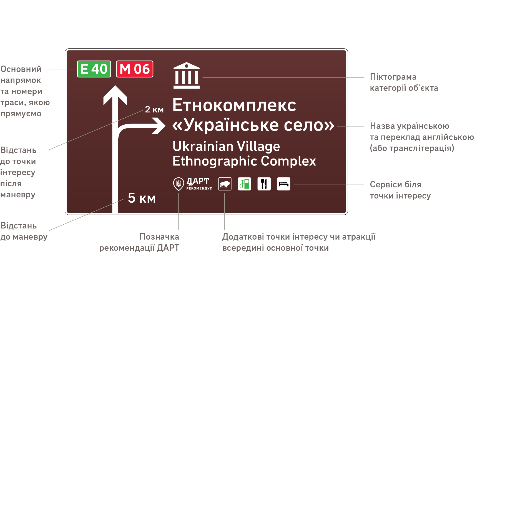
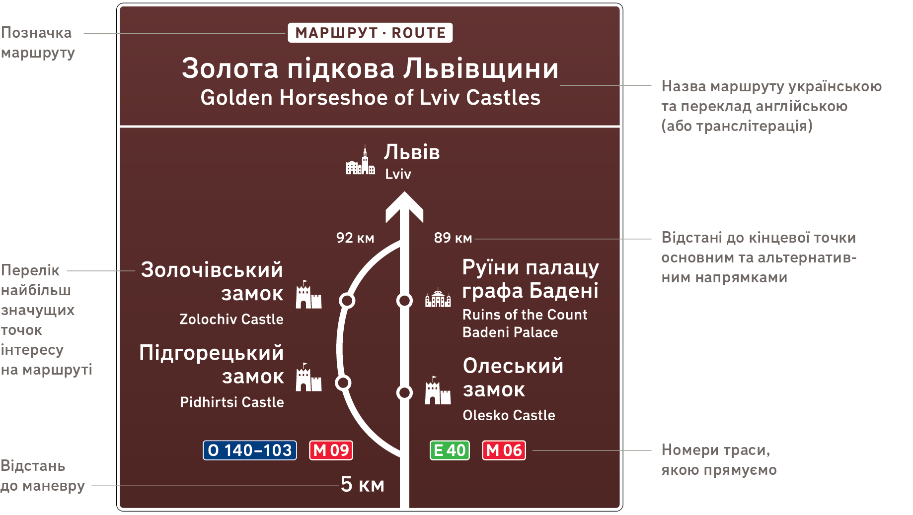
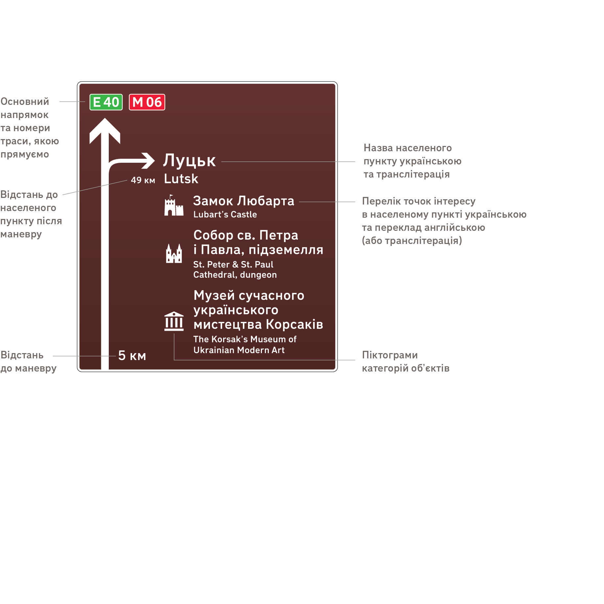
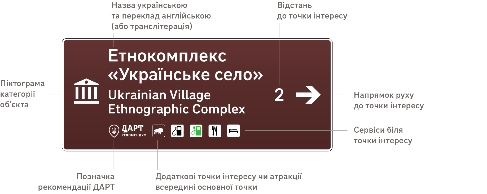
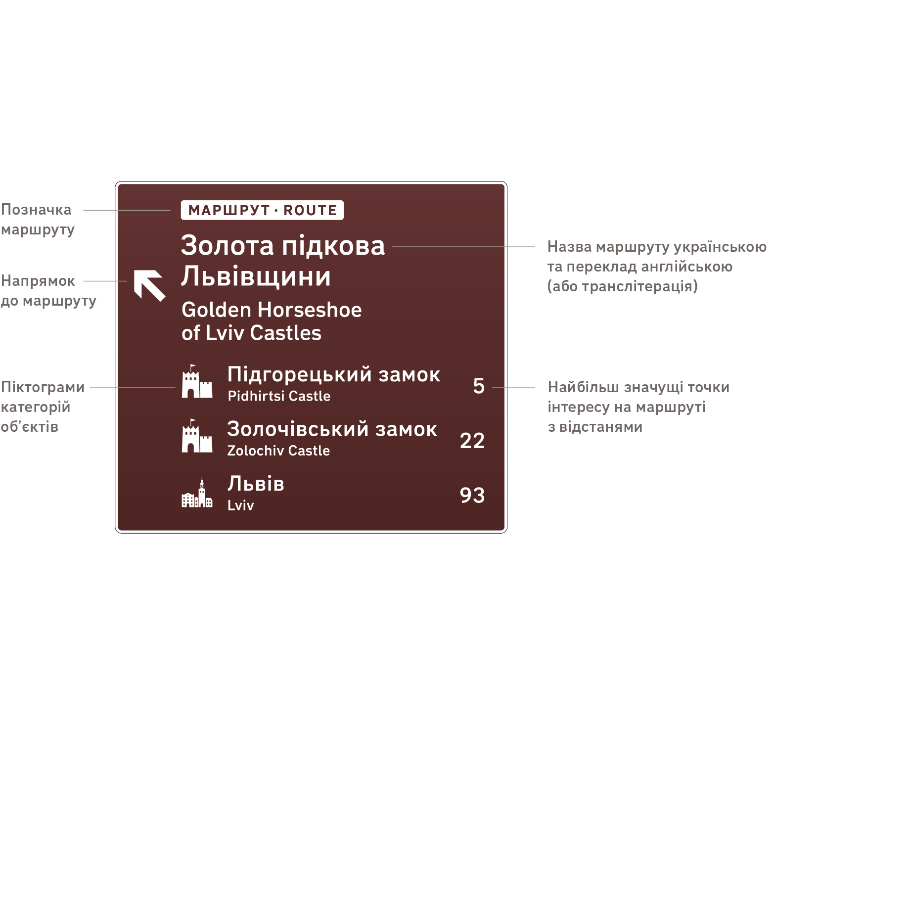
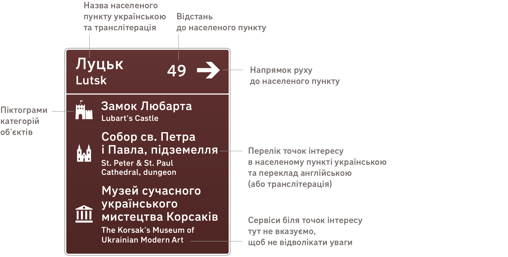
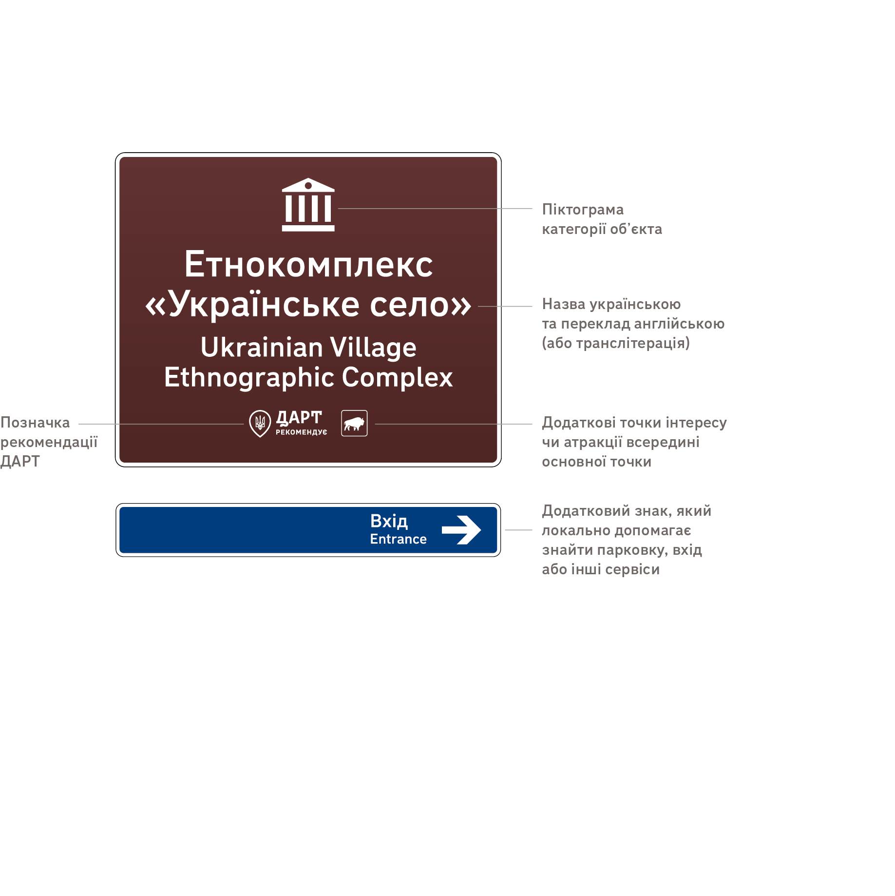
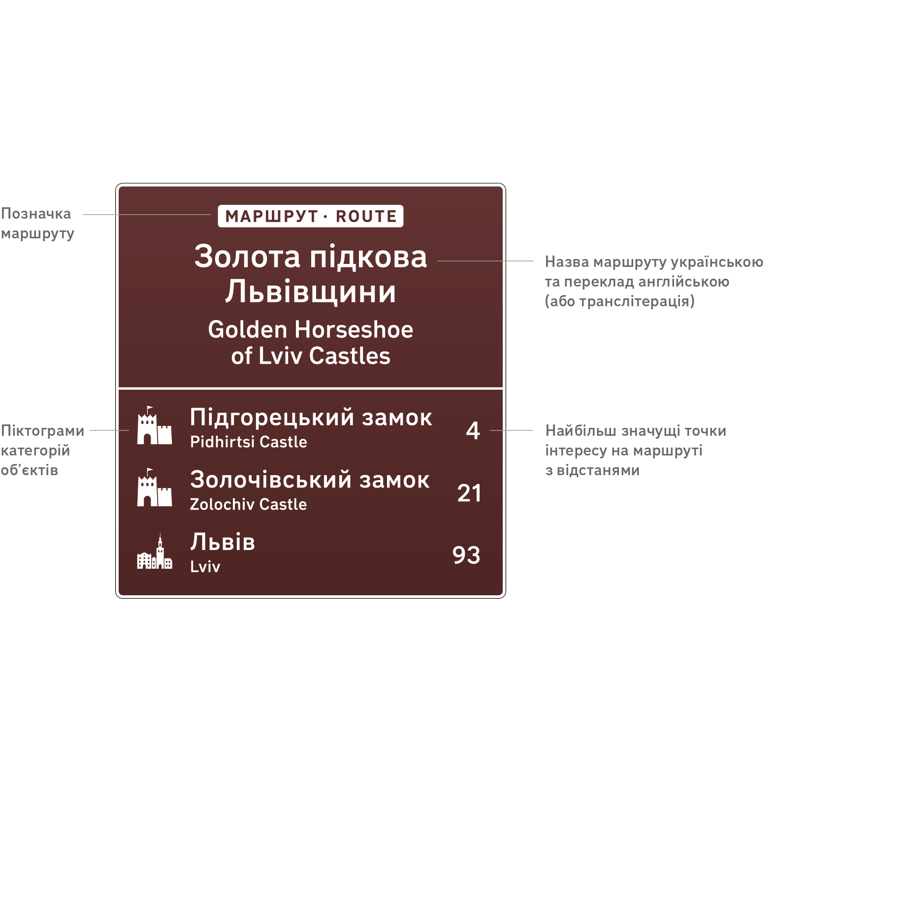
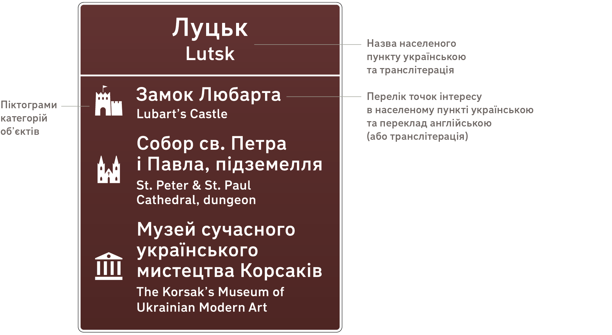
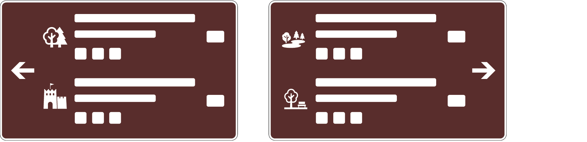

# Розділ 4. Типи знаків

## 4.1 Набір типових знаків :id=matrix

4.1.1 У відповідності до типів об’єктів та типового сценарію відвідування цих об’єктів ми розробили набір типових знаків, що вкладається в матрицю.

Таблиця 4.1 — Матриця типів знаків туристичної дорожньої навігації

<table class="sign-matrix">
  <tr valign="top">
   <td>
   </td>
   <td><strong>A</strong>
      
Попередній

   </td>
   <td><strong>B</strong>
      
Напрямний

   </td>
   <td><strong>C</strong>
      
Підтверджувальний

   </td>
  </tr>
  <tr valign="top">
   <td><strong>1</strong>
      
Окрема точка інтересу

   </td>
   <td data-sign="a1"><strong>A1</strong>
      
Попереджає, що скоро буде з’їзд до точки інтересу

   </td>
   <td data-sign="b1"><strong>B1</strong>
      
Направляє на з’їзд до точки інтересу

   </td>
   <td data-sign="c1"><strong>C1</strong>
      
Підтверджує прибуття до точки інтересу

   </td>
  </tr>
  <tr valign="top">
   <td><strong>2</strong>
      
Туристичний маршрут

   </td>
   <td data-sign="a2"><strong>A2</strong>
      
Попереджає, що скоро буде виїзд на туристичний маршрут (або з’їзд до нього)

   </td>
   <td data-sign="b2"><strong>B2</strong>
      
Направляє до туристичного маршруту

   </td>
   <td data-sign="c2"><strong>C2</strong>
      
Підтверджує виїзд на туристичний маршрут

   </td>
  </tr>
  <tr valign="top">
   <td><strong>3</strong>
      
Туристичний населений пункт

   </td>
   <td data-sign="a3"><strong>A3</strong>
      
Попереджає, що скоро буде з’їзд до туристичного населеного пункту

   </td>
   <td data-sign="b3"><strong>B3</strong>
      
Направляє до туристичного населеного пункту

   </td>
   <td data-sign="c3"><strong>C3</strong>
      
Підтверджує прибуття до туристичного населеного пункту

   </td>
  </tr>
</table>

## 4.2 Попередні знаки (тип A) :id=type-a

4.2.1 Попередні знаки завчасно попереджають водія, що скоро буде з’їзд до окремої точки інтересу, туристичного маршруту (або виїзд на нього) чи туристичного населеного пункту.

#### Попередній знак до окремої точки інтересу (тип A1) :id=a1

Ілюстрація 4.1 — Приклад знака A1

#### Попередній знак до туристичного маршруту (тип A2) :id=a2

На схемі вказують не більше двох туристичних об’єктів (точок інтересу та населених пунктів) в одному напрямку. Для відображення обирають найбільш значущі об’єкти.

Для кільцевих маршрутів верхній об’єкт на знаку — найбільш віддалений, що має високу значущість. Якщо до цього об’єкту водій рухатиметься поточною дорогою (не змінюватиме автошляху), на нього вказують стрілкою.

Ілюстрація 4.2 — Приклад знака A2

#### Попередній знак до туристичного населеного пункту (тип A3) :id=a3

Для населеного пункту відображають не більше трьох точок інтересу. Варто обирати найбільш значущі точки інтересу з різних категорій, щоб відобразити спектр вражень, що може отримати турист, відвідуючи цей населений пункт.

Ілюстрація 4.3 — Приклад знака A3

## 4.3 Напрямні знаки (тип B) :id=type-b

4.3.1 Напрямні знаки показують маневр, який потрібно зробити водієві, щоб дістатися певного туристичного об’єкта або декількох об’єктів.

#### Напрямний знак до окремої точки інтересу (тип B1) :id=b1

Для деяких напрямних знаків трапляється так, що напрямок до точки інтересу відрізняється від напрямку до певного сервісу. У такому разі даний сервіс (або декілька сервісів) не вказують на відповідному знаку. Тобто деякі напрямні знаки, що скеровують до певної точки інтересу, можуть відображати певний сервіс, а деякі ні. Що ближче напрямний знак до точки інтересу, то ймовірніша ця ситуація.

Ілюстрація 4.4 — Приклад знака B1

На знаках B1 вказують не більше трьох окремих точок інтересу. Якщо існує потреба відобразити більше, ніж три точки, їх відображають на окремих знаках, згрупувавши за напрямками (для розміщення окремих знаків див. [Розділ 5. Розміщення знаків](/5-placement)).

Ілюстрація 4.5 — Два окремі знаки для чотирьох точок, на кожному знаку свій напрямок

#### Напрямний знак до туристичного маршруту (тип B2) :id=b2

На знаках B2 відображають до трьох об’єктів (точок інтересу та туристичних населених пунктів). Об’єкти, відображені до цього на знаку A2, відображають і на знаках B2. Останнім відображають кінцевий об’єкт, а для кільцевих маршрутів — найбільш віддалений, що має високу значущість.

Перед в’їздом на кільцевий маршрут встановлюють два напрямних знаки — в обох напрямках. Останній об’єкт в переліках об’єктів на цих двох знаках має збігатися. Таким чином водій матиме можливість зрозуміти, що може дістатися двома альтернативними шляхами до одного й того ж самого об’єкта.

Ілюстрація 4.6 — Приклад знака B2

#### Напрямний знак до туристичного населеного пункту (тип B3) :id=b3

На знаку B3 відображають ті самі точки інтересу, що були відображені до цього на знаку A3.

Ілюстрація 4.7 — Приклад знака B3

## 4.4 Підтверджувальні знаки (тип C) :id=type-c

4.4.1 Підтверджувальні знаки дають розуміння, що водій дістався певної точки інтересу, туристичного маршруту або туристичного населеного пункту.

#### Підтверджувальний знак окремої точки інтересу (тип C1) :id=c1

Якщо в безпосередній близькості до точки інтересу або всередині точки є один або декілька сервісів, наведених у списку вище (див. [2.4 Сервіси](/2-object-types?id=services)), напрямки до них відображають на додатковій синій панелі. Також на цій панелі вказують напрямок до входу, якщо підтверджувальний знак встановлено на парковці.

Ілюстрація 4.8 — Приклади знака C1

#### Підтверджувальний знак туристичного маршруту (тип C2) :id=c2

На знаку C2 відображають ті самі об’єкти, що й на знаку A2 до цього.

Ілюстрація 4.9 — Приклад знака C2

#### Підтверджувальний знак туристичного населеного пункту (тип C3) :id=c3

На знаку C3 відображають ті самі точки інтересу, що відображалися до цього на знаках A3 та B3.

Ілюстрація 4.10 — Приклад знака C3

