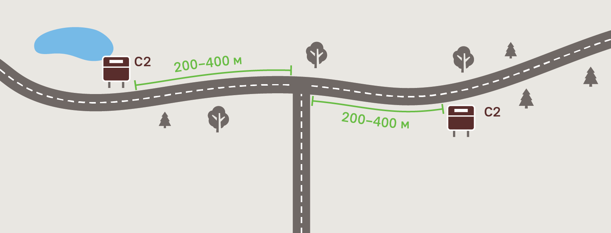
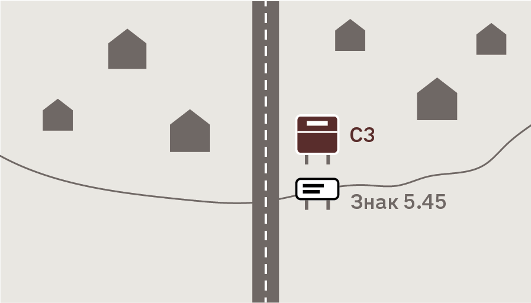
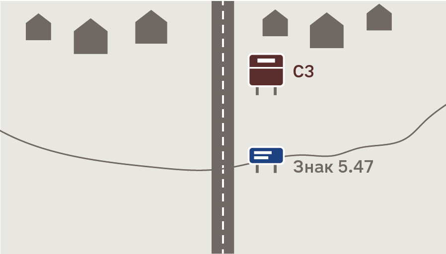

# Розділ 5. Розміщення знаків

## 5.1 Загальні рекомендації з розміщення

5.1.1 Дорожні знаки розташовуються на дорозі таким чином, щоби водій міг комфортно пройти кожен з етапів сценарію відвідування об’єкта (див. [3.2 Користувацький сценарій](#)): мав достатньо часу для ухвалення рішення і не створював аварійних ситуацій.
1. Дізнається про наявність об’єкта поруч і вирішує, чи варто його відвідати, та готується до маневру.
1. Виконує маневр.
1. Пересвідчується, що прямує у вірному напрямку.
1. Розуміє, що приїхав туди, куди планував.

5.1.2 Нижче наведено рекомендовані відстані для встановлення знаків кожного типу, але остаточне рішення щодо конкретного місця встановлення знака має ухвалювати проєктант, виходячи з власної експертизи та особливостей конкретної ділянки. Проєктант може змінювати ці відстані або ж зовсім відмовитися від туристичного знака, щоб:
* не створювати ділянок, перенасичених дорожніми знаками,
* не відволікати увагу водія на аварійно-небезпечних ділянках (на крутих поворотах, в зоні з обмеженою видимістю тощо),
* чіткіше й однозначніше спрямовувати водія в складній дорожній мережі.

## 5.2 Попередні знаки (тип A)

5.2.1 Попередні вказівники до окремих точок інтересу, маршрутів та населених пунктів встановлюють від місця маневру (наприклад, з’їзду з поточної траси):
* за 5 км для ділянок дороги з обмеженням швидкості 90 км/год і більше (за необхідності відстань можна зменшувати аж до 2 км),
* за 2–3 км для ділянок з обмеженням менше 90 км/год (можна зменшувати до 1 км).

Ілюстрація 5.1 — Схема розташування попереднього знака на трасі з обмеженням швидкості 90–130 км/год

Ілюстрація 5.2 — Схема розташування попереднього знака на трасі з обмеженням швидкості 30–70 км/год

## 5.3 Напрямні знаки (тип B)

5.3.1 Напрямні знаки встановлюють на безпечній відстані від місця реакції, щоби дати можливість сприйняти знак, ухвалити остаточне рішення та виконати маневр. Для цього, обираючи відстань, ми враховуємо обмеження швидкості, що діє на відповідній ділянці дороги.

Місцем реакції ми вважаємо точку, де водієві потрібно розпочати маневр.

Зазначені в таблиці відстані є бажаними. Проте знаки потрібно встановлювати так, щоби вони не плутали водія — не спрямовували до некоректного з’їзду. Тобто встановлювати вже після найближчого з’їзду в тому самому напрямку, що й до об’єкта, який ознаковують.

Таблиця 5.1 — Відстань від місця реакції до знака напрямку

Ілюстрація 5.3 — Приклад розміщення напрямного знака ближче, ніж на бажаній відстані. У щільній мережі вулиць знак встановлено за останнім поворотом в тому самому напрямку, що й точка інтересу

5.3.2 Якщо знаків напрямку потрібно встановити декілька поспіль, їх встановлюють на відстані 60–80 м один від одного на ділянках з обмеженням швидкості 90–130 км/год і 30–50 м на ділянках з обмеженням, меншим за 90 км/год. У такому разі, відстань до місця реакції рахують по відношенню до останнього знака (найближчого до місця реакції).

5.3.3 Для знаків обирають послідовність у відповідності до складності маневру. Знаки напрямку, які потребують найскладнішого маневру, встановлюють найпершими: 
* розворот,
* поворот наліво,
* поворот направо, 
* рух прямо.

Ілюстрація 5.4 — Схема розміщення двох напрямних знаків, що спрямовують до точок інтересу в різних напрямках

5.3.4 Напрямні знаки встановлюють на всьому шляху до туристичного об’єкта в тих місцях, де основна дорога різко змінює напрямок, водієві потрібно з’їхати з основної дороги або ж виконати складний маневр. Також знаки напрямку встановлюють для підтвердження коректності напрямку руху після неоднозначних і складних ділянок (розв’язки, складні перехрестя тощо).

5.3.5 Знаки напрямку, що стосуються окремої точки інтересу, повинні спрямовувати водія до офіційного паркувального майданчика цієї точки. Якщо облаштованого паркувального майданчика немає, знаки спрямовують якомога ближче до самої точки (входу, якщо він є). Знаки напрямку закінчуються там, де закінчується дорога з твердим покриттям.

Ілюстрація 5.5 — Схема розміщення напрямних знаків: до маневру (спрямовує водія) та після маневру (підтверджує коректність обраного напрямку)

## 5.4 Підтверджувальні знаки (тип C) Підтверджувальний знак окремої точки інтересу

5.4.1 Підтверджувальний знак прибуття до окремої точки інтересу встановлюють на в’їзді до облаштованого паркувального майданчика (ілюстрація 5.6).

Якщо облаштованого паркувального майданчика поблизу немає, знак встановлюють якомога ближче до основного входу до точки інтересу (ілюстрація 5.7).

Ілюстрація 5.6 — Схема розміщення підтверджувального знака на в’їзді до паркувального майданчика

5.4.2 Трапляються ситуації, в яких автомобілем неможливо доїхати до самої точки інтересу дорогою з твердим покриттям. Якщо відстань, яку треба пройти пішки, становить понад 150 м, то замість знака підтвердження останнім на маршруті встановлюють напрямний знак: в тому місці, де закінчується дорога з твердим покриттям (ілюстрація 5.8).

Ілюстрація 5.7 — Схема розміщення підтверджувального знака якомога ближче до точки інтересу

Ілюстрація 5.8 — Схема розміщення напрямного знака замість підтверджувального

Підтверджувальний знак туристичного маршруту

5.4.3 Підтверджувальний знак в’їзду на туристичний маршрут встановлюють за 200–400 м після в’їзду на маршрут.

5.4.4 Якщо маршрут кільцевий або водій в’їжджає на маршрут не на початку, встановлюють два підтверджувальні знаки для кожного в’їзду на маршрут — по одному в кожному з напрямків.

Ілюстрація 5.9 — Схема розміщення підтверджувальних знаків при в’їзді на кільцевий туристичний маршрут

5.4.5 Підтверджувальний знак маршруту також встановлюють через 30 км після останнього знака, що дає водієві підтвердження, що він все ще рухається тим самим туристичним маршрутом (напрямного чи підтверджувального).

Ілюстрація 5.10 — Схема розміщення додаткового підтверджувального знака на туристичному маршруті

Підтверджувальний знак туристичного населеного пункту

5.4.6 Підтверджувальний знак в’їзду в туристичний населений пункт встановлюють у місці, де починається забудова. Це місце може збігатися з адміністративною межею населеного пункту. Тоді туристичний знак встановлюють після знака 5.45 «Початок населеного пункту» на білому тлі або 5.47 «Початок населеного пункту» на синьому тлі на відстані 100–200 м.

Ілюстрація 5.11 — Схема розміщення підтверджувального знака на в’їзді до населеного пункту, де початок забудови збігається з адміністративною межею

Ілюстрація 5.12 — Схема розміщення підтверджувального знака на в’їзді до населеного пункту, де забудова починається на значній відстані від адміністративної межі
