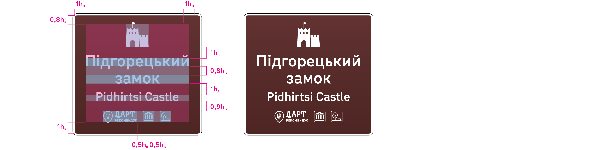

# Розділ 7. Побудова знаків

## 7.1 Попередні знаки (тип A) 

#### Попередній знак до окремої точки інтересу (тип А1)

7.1.1 Знак типу A1 складається з:
1. схеми маневру;
2. позначки основної траси, якою прямуємо;
3. відстані до маневру;
4. відстані до точки інтересу після маневру;
5. піктограми категорії;
6. назви точки інтересу українською;
7. переклад англійською (або транслітерація);
8. позначок Всесвітньої спадщини ЮНЕСКО, рекомендації ДАРТ, переліку додаткових точок інтересу та основних сервісів (максимально шість позначок).

Елементи 5–8 складають блок точки інтересу.

7.1.2 Граничні розміри знака підлаштовуються під розміри інформації. Побудову знака необхідно визначати з огляду на найкращу розпізнаваність маневру. Економія матеріалів має менше значення.

7.1.3 Потрібно розносити блоки інформації на знаках, керуючись принципом близькості (див. п. 6.1.1). Треба явно показати, якого об’єкта та напрямку стосується відповідна інформація. Важливо уникати хибних візуальних зв’язків елементів, які можуть ввести водія в оману.

7.1.4 Схема маневру показує, який маневр потрібно здійснити для з’їзду до точки інтересу. Маневр має бути однозначно зрозумілим.

Маневр містить:
* основний напрямок, яким ми зараз прямуємо;
* другорядний, на який потрібно з’їхати з основної дороги, щоб дістатися точки інтересу.

На основному напрямку достатньо вказати лише номер траси: туристичні знаки доповнюють сині та зелені знаки маршрутного орієнтуванння, а не замінюють їх.

7.1.5 Товщина лінії основного напрямку — 0,45hв, а другорядного — 0,325hв (див. п. 6.4.4).
Блок точки інтересу компонується так, щоб знак вийшов компактнішим. Усі елементи вирівнюються за лівим краєм. Піктограма категорії розташовується над назвами (коли точка інтересу одна), а блок додаткових позначок — під назвами.

Ілюстрація 7.1 — Знак з поворотом до точки інтересу праворуч від основної траси

Позначка основної траси, якою прямуємо, заввишки 1,3hв. Вона вирівнюється за центром стрілки основного напрямку. Якщо номерів кілька, то вони розміщуються на відстані 0,4hв.

Розмір тексту відстані до маневру такий самий, як розмір англійської назви, а розмір тексту відстані після маневру до точки інтересу — 0,5hв.

Відстань до маневру та відстань до точки після маневру не мають стояти на одній лінії. Також відстань після маневру потрібно розміщувати над стрілкою маневру, вирівнюючи за краєм стрілки. Таке розташування підкреслює різницю цих цифр.

За наявності додаткових позначок біля назви точки інтересу потрібно додати відступ 0,4hв до «5 км» (відстань до маневру), щоб більше відокремити цифру від блоку точки інтересу.

Ілюстрація 7.2 — Знаки з поворотом ліворуч та з віднесеним поворотом ліворуч до точки інтересу. Для більшої компактності відстань до маневру (5 км) переносять ліворуч від лінії. Відстань до точки інтересу розташовується над стрілкою для кращого візуального розділення

7.1.6 Під час переносів тексту треба уникати утворення занадто довгих чи занадто коротких рядків та всього блоку тексту.
Потрібно уникати утворення візуальних дірок між рядками тексту: коли між двома довгими рядками утворюється занадто короткий.
Не можна відображати текст у три і більше рядків по одному короткому слову в кожному з них.
За можливості лишати власну назву об’єкта або ім’я на одному рядку.
Не розривати за можливості слова, що пишуться через дефіс.
Потрібно уникати переносів, які розділяють слово на кілька рядків. Замість цього потрібно переносити все слово на окремий рядок.
Погано
Короткі рядки по одному слову та розрив короткого слова з дефісом
Замок-
музей
Радомисль
Radomysl Castle Museum
Перенос власної назви та візуальна «діра» між рядками тексту
Кар’єр «Високий камінь»
Vysokyi Kamin Quarry
Занадто довгий блок тексту, що робить дуже довгим сам знак
Культурно-археологічний
центр «Пересопниця»
Peresopnytsia Cultural and Archaeological Center
Перенос всередині слова, що розділяє його на дві окремі частини
Кар’єр «Коростишівський каньйон» Korostyshiv Canyon Quarry
Добре
Не розривається дефіс та немає коротких рядків по одному слову
Замок-музей
Радомисль
Radomysl Castle Museum
Не розривається власна назва та немає «діри» у тексті
Кар’єр
«Високий камінь» Vysokyi Kamin Quarry
Допустимий перенос довгого слова з дефісом
Культурно-
археологічний центр
«Пересопниця»
Peresopnytsia Cultural and Archaeological Center
Замість розриву слова потрібно перенести назву на кілька рідків
Кар’єр «Коростишівський каньйон»
Korostyshiv Canyon Quarry

7.1.7 На знаках, де основний напрям іде вбік, а до точки інтересу потрібно продовжувати рух прямо, блок точки інтересу не змінює свій вигляд та розташовується зверху
на відстані 0,6hв від стрілки. Весь блок вирівнюється так, щоб він однозначно стосувався напрямку вперед.
Відстань до точки інтересу розташовується обабіч від стрілки та вирівнюється разом з відстанню до маневру (ілюстрація 7.3).
Довжина стрілок маневру обирається візуально так, щоб маневр однозначно зчитувався на відстані та кожен напрямок явно відрізнявся між собою.

Ілюстрація 7.3 — Знак з напрямком прямо до точки інтересу, коли основна траса продовжується плавно ліворуч (наприклад, на об’їзних дорогах навколо населених пунктів). Довжина стрілок обирається візуально, щоб напрямок убік візуально відділявся від напрямку прямо

Ілюстрація 7.4 — Знак з напрямком прямо до точки інтересу, коли основна траса повертає різко праворуч. Довжна стрілки прямо обирається така, щоб увесь блок візуально відділявся від повороту, не менше 2–3hв від розгалуження

7.5???

Ілюстрація 7.6 — Знак дворівневої розв’язки зі шляхопроводом та з напрямком прямо до точки інтересу. На цьому знаку важливо чітко передати будову розв’язки та самого маневру. Шлях, який проходить у реальності вище, зображуємо безперервною лінією

7.7???

Ілюстрація 7.8 — Знак кільцевої розв’язки, де напрямок до точки інтересу прямо, а основна траса продовжується ліворуч. Таке кільце варто робити розпізнаваним, не менше 2–3hв у діаметрі

Ілюстрація 7.9 — Знак Т-подібного перехерестя або розв’язки, де один з напрямків до точки інтересу, а інший — продовження руху основною трасою. Оголівки стрілок напрямків потрібно розташувати на рівні першого рядка точки інтересу. Довжина стрілок обирається візуально, щоб відстань до точки інтересу (12 км) була на відстані

Ілюстрація 7.10 — Знак розв’язки «листок конюшини», де основна траса продовужється праворуч (наприклад, об’їзна дорога), а до точки

1hв інтересу потрібно повернути розв’язкою ліворуч

Ілюстрація 7.11 — Знак розв’язки «листок конюшини», де до точки інтересу потрібно звернути ліворуч, а основний напрямок продовжується прямо.

Для більшої компактності відстань до маневру (5 км) можна перенести ліворуч від лінії.
Відстань до точки інтересу в такому разі потрібно розташувати над стрілкою для кращого візуального розділення. Сам маневр повороту з позначкою шляхопроводу потрібно розташовувати від відстані до маневру (5 км) не ближче ніж 0,8hв

Ілюстрація 7.12 — Знак трубоподібної розв’язки, де до точки інтересу потрібно з’їхати з основної дороги та повернути ліворуч під шляхопроводом

Ілюстрація 7.13 — Знак складної розв’язки (наприклад, «діамантова», «гантеля», «кістка» тощо) із трьома напрямками.

Щоб зунеможливити помилку водія у виборі напрямку до точки інтересу, доцільно показувати на схемі маневру всі наявні напрямки.
На цьому прикладі, крім основного напрямку (прямо) та з’їзду до точки інтересу (праворуч), вказують ще з’їзд на трасу М09 (ліворуч)

Ілюстрація 7.14 — Знак з двома точками інтересу, де до однієї веде поворот праворуч, а до іншої — віднесений поворот ліворуч.

Блоки точок інтересу потрібно вирівняти за першим рядком тексту, це зробить вигляд знака охайнішим. Стрілки потрібно розташувати теж на рівні перших рядків

Ілюстрація 7.15 — Знак повороту до двох точок інтересу в одному напрямку.

Якщо потрібно показати дві чи три точки інтересу в одному напрямку, то піктограми кожної точки розташовують ліворуч від блоку тексту на відстані 0,8hв та вирівнюють за центром блоку з урахуванням оптичої компенсації.

Першою точкою вказують ту, що ближче. Відстані до точок інтересу розташовують під стрілкою та вирівнюють за правим краєм. Перша відстань розташовується знизу текстового блоку, інші — за центрами блоків.

Стрілка праворуч вирівнюється за верхнім краєм текстового блоку або за центром першої точки інтересу

Ілюстрація 7.16 — Знак з кількома точками прямо та продовженням основної траси після кільця ліворуч (трубоподібна, Т-подібна тощо).

Вище (першою) вказують точку, розташовану ближче. Таким чином завжди зберігається послідовність точок на різних знаках.
Відстані до точок інтересу розташовують ліворуч від блоків тексту та вирівнюють за центром блоків

#### Попередній знак до туристичного маршруту (тип А2)

7.1.8 На схемі вказують не більше чотирьох-п’яти туристичних об’єктів (точок інтересу та населених пунктів). Для відображення обирають найбільш значущі об’єкти на маршруті українською та переклад англійською (або транслітерація).
Якщо об’єкти відображають на декількох напрямках, то в кожному з них зазначають не більше двох. Для кільцевих маршрутів верхній об’єкт на знаку — найбільш віддалений, що має високу значущість. Якщо до цього об’єкту водій рухатиметься поточною дорогою (не змінюватиме автошляху), на нього вказують стрілкою.

Розміри елементів текстового блоку

Ілюстрація 7.17 — Знак кільцевого маршруту «Золота підкова Львівщини» за 5 км до заїзду на маршрут з траси М 06 .

Одна частина проходить основною дорогою прямо до Львова трасою М 06 , інша черезтраси О140–103 та М09 також до Львова

Ілюстрація 7.18 — Знак кільцевого маршруту «Золота підкова Львівщини» за 5 км до з’їзду з траси М 09 , сама траса продовжується праворуч.
 

На схемі показано: прямо дорога О140–103 тадві точки інтересу, потім з’їзд на трасу М06 , ще дві точки інетресу та кінцева точка Львів

Ілюстрація 7.19 — Знак кільцевого маршруту «Золота підкова Львівщини» при виїзді зі Львова натрасу М09

7.1.9 

#### Попередній знак до туристичного населеного пункту (тип А3)

Для населеного пункту відображають не більше трьох точок інтересу. Варто обирати найбільш значущі точки інтересу з різних категорій, щоб відобразити спектр вражень, що може отримати турист, відвідуючи цей населений пункт.

Блоки точок інтересу розташовуються під назвою населеного пункту та зажди вирівнюються за лівою стороною.

Схеми маневрів подбні до знаків типу А1. Стрілка напрямку направляється на перший рядок назви населеного пункту.

Ілюстрація 7.20 — Знаки з’їду (праворуч та ліворуч) з основної дороги до туристичного населеного пункту, в якому вказано три точки інтересу

7.2.2
7.2.3 
7.2.4

## 7.2 Напрямні знаки (тип B)

#### Напрямний знак до окремої точки інтересу (тип B1)

Напрямний знак до окремої точки інтересу складається:
– із напрямку (див. 6.4 Стрілки);
– блоку з піктограми категорії та назви точки інтересу українською та переклад англійською або транслітерація (див. 6.5 Піктограми, 6.3 Текст); – додаткових позначок та піктограм (див. п. 6.5.4–6.5.8);
– відстані.

Напрямки вперед (↑), прямо і ліворуч (↖), ліворуч (←) та розворот (⟲) вирівнюються за лівим краєм знака. Напрямки прямо і праворуч (↗) та праворуч (→) — за правим.

Піктограму категорії розташовують ліворуч від блоку назви та додаткових позначок та вирівнюють за його центром з урахуванням оптичної компенсації (див. п. 6.5.4).

Відстань вирівнюють за центром блоку з назви та додаткових позначок. Відстань вказують у кілометрах без одиниць вимірювання.

Якщо відстань менша за 1 км, то вказуть у десятих через кому. Найменша відстань, яку можливо вказати — 0,1 км.

Ілюстрація 7.21 — Приклади побудови знаків В1

Ілюстрація 7.22 — Приклади побудови знаків В1

Ілюстрація 7.23 — Приклад побудови знаків В1 із довгою

7.2.5

7.2.6

На знаках B1 вказують не більше ніж три точки інтересу. Якщо існує потреба відобразити понад три точки, їх відображають на окремих знаках, згрупувавши за напрямками (для розміщення окремих знаків див. 5.3 Напрямні знаки (тип B)).

Якщо декілька точок інтересу розташовуються в одному напрямку, то вказують одну стрілку. Її вирівнюють за центром блоків з назв та додаткових піктограм усіх вказа-

Ілюстрація 7.24 — Приклад знака B1 із двома точками інтересу в одному напрямку

Ілюстрація 7.25 — Приклад знака В1 із двома та трьома точками інтересу в одному напрямку з додатковими піктограмами

7.2.7 Якщо на знаку вказують декілька точок інтересу в різних напрямках, тоді:
– напрямки відділяють лінією-розділювачем;
– стрілку кожного напрямку вирівнюють за центром блоків з назв та додаткових піктограм усіх вказаних в одному напрямку точок. Порядок відображення стрілок на знаку див. п. 6.4 Стрілки.

Ілюстрація 7.26 — Приклад знака В1 із двома точками інтересу в різних напрямках

#### Напрямний знак до туристичного маршруту (тип B2)

7.2.8 Напрямний знак в’їзду до туристичного маршруту складається з трьох частин:
– напрямок до маршруту;
– позначення маршруту (позначка маршруту, назва маршруту українською та переклад англійською (або транслітерація));
– перелік найбільш значущих точок на маршруті, починаючи з найближчої.

Додаткові позначки: Всесвітньої спадщини ЮНЕСКО, рекомендації ДАРТ, сервісів — на знаках B2 не відображають.

7.2.9 Максимально можна вказати три точки інтересу.

7.2.10 Піктограми категорій точок інтересу відцентровуються відносно одна одної.

Ілюстрація 7.27 — Приклад будови знака B2

Ілюстрація 7.28 — Приклад будови знака B2

#### Напрямний знак до туристичного населеного пункту (тип B3)

7.2.11 Напрямний знак в’їзду до туристичного населеного пункту складається з двох частин: 
– назви населеного пункту українською та транслітерація;
– переліку найбільш значущих точок у цьому населеному пункті, починаючи з найближчої.

Частини відділяють одна від одної лінією-розділювачем.

7.2.12 Додаткові позначки: Всесвітньої спадщини ЮНЕСКО, рекомендації ДАРТ, сервісів — на знаках B3 не відображають.

7.2.13 Максимально можна вказати три точки інтересу.

Ілюстрація 7.29 — Приклад будови знака B3

## 7.3 Підтверджувальні знаки (тип C)

#### Підтверджувальний знак окремої точки інтересу (C1)

7.3.1 На підтверджувальному знаку прибуття до окремої точки інтересу вказують піктограму категорії та назву точки українською та переклад англійською (або транслітерація).

Піктограму та написи вирівнюють за центром знака.

Позначки сервісів на знаках не відображають.

7.3.2

Ілюстрація 7.30 — Будова знака С1

Якщо точка інтересу входить до списку Всесвітньої спадщини ЮНЕСКО, є рекомендованою ДАРТ або ж має свої внутрішні точки інтересу, то ці позначки розташовуються під назвою та вирівнюються за центром знака.

Ілюстрація 7.31 — Приклад побудови знака С1 із позначкою «ДАРТ Рекомендує»

Ілюстрація 7.32 — Приклад побудови знака С1 із позначкою «ДАРТ Рекомендує» та внутрішніми точками інтересу «Музей» та «Міські парки та сади»

7.3.3 Додатковий знак, на якому вказують напрямки до входу, паркувального майданчика та сервісів, має синє тло. Його ширина має збігатися з шириною знака С1, під яким його розташовано (ілюстрація 7.0).

Ілюстрація 7.33 — Побудова додаткового знака, що спрямовує до входу

Ілюстрація 7.34 — Побудова додаткового знака, що спрямовує до входу та до паркувального майданчика

Підтверджувальний знак туристичного маршруту (C2)

7.3.4 Підтверджувальний знак в’їзду на туристичний маршрут складається з двох частин:

* позначання маршруту (позначка маршруту, назва маршруту українською та переклад англійською (або транслітерація));
* переліку найбільш значущих точок на маршруті, починаючи з найближчої.

Частини відділяють одна від одної лінією-розділювачем.

Додаткові позначки: Всесвітньої спадщини ЮНЕСКО, рекомендації ДАРТ, сервісів — на знаках С2 не відображають.

7.3.5 Максимально можна вказати три точки інтересу.

7.3.6 Піктограми категорій точок інтересу відцентровуються відносно одна одної.

Ілюстрація 7.35 — Будова знака С2

Ілюстрація 7.36 — Приклади підтверджувальних знаків туристичних маршрутів з двома та трьома найбільш значущими точками інтересу

#### Підтверджувальний знак туристичного населеного пункту (C3)

7.3.8 Підтверджувальний знак в’їзду до туристичного населеного пункту складається з двох частин:
– назви населеного пункту українською та транслітерація;
– переліку найбільш значущих точок у цьому населеному пункті, починаючи з найближчої.

Частини відділяють одна від одної лінією-розділювачем.

Додаткові позначки: Всесвітньої спадщини ЮНЕСКО, рекомендації ДАРТ, сервісів — на знаках С3 не відображають.

7.3.9 Максимально можна вказати три точки інтересу.

Ілюстрація 7.37 — Будова знака С3
