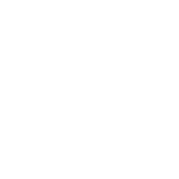
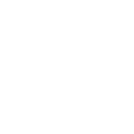
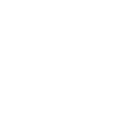
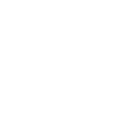

# Додаток А. Піктограми

Бібліотека піктограм туристичної дорожньої навігації: 44 піктограми категорій точок інтересу, 5 додаткових позначок і 8 піктограм сервісів. Кожну піктограму можна завантажити окремо у форматах SVG, PNG, EPS і PDF або весь набір одним архівом, а також як файли DWG та AI.

Як обирати піктограму для точки інтересу описано в [2.1 Точка інтересу](/2-object-types?id=poi), правила розміщення піктограм на знаках — у [6.5 Піктограми](/6-elements?id=pictograms). Піктограми поширюються на умовах ліцензії CC BY-ND: їх можна вільно використовувати на знаках із зазначенням авторства, але не можна змінювати форму самих піктограм.

<!-- icons:start -->

  <input type="search" id="icon-search" class="icon-search" placeholder="Знайти піктограму…" aria-label="Пошук піктограми">
  

    <a class="button" href="icons/zip/TouristRoadSigns-Icons-all.zip" download>Завантажити все (ZIP)</a>
    <a class="button button-secondary" href="icons/zip/TouristRoadSigns-Icons-svg.zip" download>SVG</a>
    <a class="button button-secondary" href="icons/zip/TouristRoadSigns-Icons-png.zip" download>PNG</a>
    <a class="button button-secondary" href="icons/zip/TouristRoadSigns-Icons-eps.zip" download>EPS</a>
    <a class="button button-secondary" href="icons/zip/TouristRoadSigns-Icons-pdf.zip" download>PDF</a>
    <a class="button button-secondary" href="icons/zip/TouristRoadSigns-Icons-svg-transparent.zip" download>SVG без тла</a>
    <a class="button button-secondary" href="icons/all/TouristRoadSigns-Icons.dwg" download>Весь набір DWG</a>
    <a class="button button-secondary" href="icons/all/TouristRoadSigns-Icons.ai" download>Весь набір AI</a>
    <a class="button button-secondary" href="icons/all/TouristRoadSigns-Icons.pdf" download>Весь набір PDF</a>
  

Нічого не знайшли. Спробуйте іншу назву або англійський відповідник.

## І. Піктограми категорій :id=categories

<h3 class="icon-group__title" id="g-remeslene-ta-lokalne-vyrobnytstvo">Ремеслене та локальне виробництво</h3>

  

  

    
Загальна піктограма

    <h4 class="icon-card__name">Ремеслене та локальне виробництво</h4>
    
Craft and local production

    
    
<a class="icon-dl" href="icons/svg/manufacture.svg" download="manufacture.svg" title="785 Б">SVG</a><a class="icon-dl" href="icons/png/manufacture.png" download="manufacture.png" title="21 КБ">PNG</a><a class="icon-dl" href="icons/eps/manufacture.eps" download="manufacture.eps" title="385 КБ">EPS</a><a class="icon-dl" href="icons/pdf/manufacture.pdf" download="manufacture.pdf" title="27 КБ">PDF</a><a class="icon-dl" href="icons/svg-transparent/manufacture.svg" download="manufacture.svg" title="696 Б">SVG без тла</a><button type="button" class="icon-copy" data-src="icons/svg/manufacture.svg">Копіювати SVG</button>

  

<h3 class="icon-group__title" id="g-torhivlia">Торгівля</h3>

  

  

    
Загальна піктограма

    <h4 class="icon-card__name">Торгівля</h4>
    
Trade

    
    
<a class="icon-dl" href="icons/svg/trading.svg" download="trading.svg" title="2 КБ">SVG</a><a class="icon-dl" href="icons/png/trading.png" download="trading.png" title="23 КБ">PNG</a><a class="icon-dl" href="icons/eps/trading.eps" download="trading.eps" title="389 КБ">EPS</a><a class="icon-dl" href="icons/pdf/trading.pdf" download="trading.pdf" title="27 КБ">PDF</a><a class="icon-dl" href="icons/svg-transparent/trading.svg" download="trading.svg" title="2 КБ">SVG без тла</a><button type="button" class="icon-copy" data-src="icons/svg/trading.svg">Копіювати SVG</button>

  

<h3 class="icon-group__title" id="g-memorialni-kladovyscha">Меморіальні кладовища</h3>

  

  

    
Загальна піктограма

    <h4 class="icon-card__name">Меморіальні кладовища</h4>
    
Memorial cemeteries

    
    
<a class="icon-dl" href="icons/svg/cemetery.svg" download="cemetery.svg" title="812 Б">SVG</a><a class="icon-dl" href="icons/png/cemetery.png" download="cemetery.png" title="15 КБ">PNG</a><a class="icon-dl" href="icons/eps/cemetery.eps" download="cemetery.eps" title="385 КБ">EPS</a><a class="icon-dl" href="icons/pdf/cemetery.pdf" download="cemetery.pdf" title="27 КБ">PDF</a><a class="icon-dl" href="icons/svg-transparent/cemetery.svg" download="cemetery.svg" title="723 Б">SVG без тла</a><button type="button" class="icon-copy" data-src="icons/svg/cemetery.svg">Копіювати SVG</button>

  

  

  

    
Піктограма окремої категорії

    <h4 class="icon-card__name">Військові кладовища</h4>
    
Military cemeteries

    
    
<a class="icon-dl" href="icons/svg/cemetery-military.svg" download="cemetery-military.svg" title="1 КБ">SVG</a><a class="icon-dl" href="icons/png/cemetery-military.png" download="cemetery-military.png" title="23 КБ">PNG</a><a class="icon-dl" href="icons/eps/cemetery-military.eps" download="cemetery-military.eps" title="386 КБ">EPS</a><a class="icon-dl" href="icons/pdf/cemetery-military.pdf" download="cemetery-military.pdf" title="27 КБ">PDF</a><a class="icon-dl" href="icons/svg-transparent/cemetery-military.svg" download="cemetery-military.svg" title="1 КБ">SVG без тла</a><button type="button" class="icon-copy" data-src="icons/svg/cemetery-military.svg">Копіювати SVG</button>

  

<h3 class="icon-group__title" id="g-mistsia-pamiati">Місця пам’яті</h3>

  

  

    
Загальна піктограма

    <h4 class="icon-card__name">Місця пам’яті</h4>
    
Places of memory

    
Пам’ятники і меморіали

    
<a class="icon-dl" href="icons/svg/memorial.svg" download="memorial.svg" title="689 Б">SVG</a><a class="icon-dl" href="icons/png/memorial.png" download="memorial.png" title="16 КБ">PNG</a><a class="icon-dl" href="icons/eps/memorial.eps" download="memorial.eps" title="385 КБ">EPS</a><a class="icon-dl" href="icons/pdf/memorial.pdf" download="memorial.pdf" title="27 КБ">PDF</a><a class="icon-dl" href="icons/svg-transparent/memorial.svg" download="memorial.svg" title="600 Б">SVG без тла</a><button type="button" class="icon-copy" data-src="icons/svg/memorial.svg">Копіювати SVG</button>

  

<h3 class="icon-group__title" id="g-arkheolohichni-pamiatky">Археологічні пам’ятки</h3>

  

  

    
Загальна піктограма

    <h4 class="icon-card__name">Археологічні пам’ятки</h4>
    
Archaeological sites

    
    
<a class="icon-dl" href="icons/svg/archeology.svg" download="archeology.svg" title="6 КБ">SVG</a><a class="icon-dl" href="icons/png/archeology.png" download="archeology.png" title="35 КБ">PNG</a><a class="icon-dl" href="icons/eps/archeology.eps" download="archeology.eps" title="400 КБ">EPS</a><a class="icon-dl" href="icons/pdf/archeology.pdf" download="archeology.pdf" title="31 КБ">PDF</a><a class="icon-dl" href="icons/svg-transparent/archeology.svg" download="archeology.svg" title="6 КБ">SVG без тла</a><button type="button" class="icon-copy" data-src="icons/svg/archeology.svg">Копіювати SVG</button>

  

<h3 class="icon-group__title" id="g-rekreatsiia-na-vodi">Рекреація на воді</h3>

  

  

    
Загальна піктограма

    <h4 class="icon-card__name">Рекреація на воді</h4>
    
Water recreation

    
    
<a class="icon-dl" href="icons/svg/recreation-water.svg" download="recreation-water.svg" title="2 КБ">SVG</a><a class="icon-dl" href="icons/png/recreation-water.png" download="recreation-water.png" title="31 КБ">PNG</a><a class="icon-dl" href="icons/eps/recreation-water.eps" download="recreation-water.eps" title="389 КБ">EPS</a><a class="icon-dl" href="icons/pdf/recreation-water.pdf" download="recreation-water.pdf" title="28 КБ">PDF</a><a class="icon-dl" href="icons/svg-transparent/recreation-water.svg" download="recreation-water.svg" title="2 КБ">SVG без тла</a><button type="button" class="icon-copy" data-src="icons/svg/recreation-water.svg">Копіювати SVG</button>

  

  

  

    
Піктограма окремої категорії

    <h4 class="icon-card__name">Пляжі та облаштовані місця для купання</h4>
    
Beaches and bathing areas

    
    
<a class="icon-dl" href="icons/svg/recreation-water-beach.svg" download="recreation-water-beach.svg" title="2 КБ">SVG</a><a class="icon-dl" href="icons/png/recreation-water-beach.png" download="recreation-water-beach.png" title="31 КБ">PNG</a><a class="icon-dl" href="icons/eps/recreation-water-beach.eps" download="recreation-water-beach.eps" title="389 КБ">EPS</a><a class="icon-dl" href="icons/pdf/recreation-water-beach.pdf" download="recreation-water-beach.pdf" title="28 КБ">PDF</a><a class="icon-dl" href="icons/svg-transparent/recreation-water-beach.svg" download="recreation-water-beach.svg" title="2 КБ">SVG без тла</a><button type="button" class="icon-copy" data-src="icons/svg/recreation-water-beach.svg">Копіювати SVG</button>

  

<h3 class="icon-group__title" id="g-rekreatsiia-na-snihu">Рекреація на снігу</h3>

  

  

    
Загальна піктограма

    <h4 class="icon-card__name">Рекреація на снігу</h4>
    
Snow recreation

    
    
<a class="icon-dl" href="icons/svg/recreation-snow.svg" download="recreation-snow.svg" title="1 КБ">SVG</a><a class="icon-dl" href="icons/png/recreation-snow.png" download="recreation-snow.png" title="18 КБ">PNG</a><a class="icon-dl" href="icons/eps/recreation-snow.eps" download="recreation-snow.eps" title="386 КБ">EPS</a><a class="icon-dl" href="icons/pdf/recreation-snow.pdf" download="recreation-snow.pdf" title="27 КБ">PDF</a><a class="icon-dl" href="icons/svg-transparent/recreation-snow.svg" download="recreation-snow.svg" title="971 Б">SVG без тла</a><button type="button" class="icon-copy" data-src="icons/svg/recreation-snow.svg">Копіювати SVG</button>

  

<h3 class="icon-group__title" id="g-rekreatsiia-na-zemli">Рекреація на землі</h3>

  

  

    
Загальна піктограма

    <h4 class="icon-card__name">Рекреація на землі</h4>
    
Land recreation

    
    
<a class="icon-dl" href="icons/svg/recreation-ground.svg" download="recreation-ground.svg" title="1 КБ">SVG</a><a class="icon-dl" href="icons/png/recreation-ground.png" download="recreation-ground.png" title="24 КБ">PNG</a><a class="icon-dl" href="icons/eps/recreation-ground.eps" download="recreation-ground.eps" title="386 КБ">EPS</a><a class="icon-dl" href="icons/pdf/recreation-ground.pdf" download="recreation-ground.pdf" title="27 КБ">PDF</a><a class="icon-dl" href="icons/svg-transparent/recreation-ground.svg" download="recreation-ground.svg" title="1 КБ">SVG без тла</a><button type="button" class="icon-copy" data-src="icons/svg/recreation-ground.svg">Копіювати SVG</button>

  

  

  

    
Піктограма окремої категорії

    <h4 class="icon-card__name">Пішохідні маршрути</h4>
    
Hiking trails

    
    
<a class="icon-dl" href="icons/svg/recreation-ground-hiking.svg" download="recreation-ground-hiking.svg" title="1 КБ">SVG</a><a class="icon-dl" href="icons/png/recreation-ground-hiking.png" download="recreation-ground-hiking.png" title="24 КБ">PNG</a><a class="icon-dl" href="icons/eps/recreation-ground-hiking.eps" download="recreation-ground-hiking.eps" title="386 КБ">EPS</a><a class="icon-dl" href="icons/pdf/recreation-ground-hiking.pdf" download="recreation-ground-hiking.pdf" title="27 КБ">PDF</a><a class="icon-dl" href="icons/svg-transparent/recreation-ground-hiking.svg" download="recreation-ground-hiking.svg" title="1 КБ">SVG без тла</a><button type="button" class="icon-copy" data-src="icons/svg/recreation-ground-hiking.svg">Копіювати SVG</button>

  

<h3 class="icon-group__title" id="g-kulturni-zaklady">Культурні заклади</h3>

  

  

    
Загальна піктограма

    <h4 class="icon-card__name">Культурні заклади</h4>
    
Cultural institutions

    
    
<a class="icon-dl" href="icons/svg/cultural.svg" download="cultural.svg" title="857 Б">SVG</a><a class="icon-dl" href="icons/png/cultural.png" download="cultural.png" title="14 КБ">PNG</a><a class="icon-dl" href="icons/eps/cultural.eps" download="cultural.eps" title="386 КБ">EPS</a><a class="icon-dl" href="icons/pdf/cultural.pdf" download="cultural.pdf" title="27 КБ">PDF</a><a class="icon-dl" href="icons/svg-transparent/cultural.svg" download="cultural.svg" title="768 Б">SVG без тла</a><button type="button" class="icon-copy" data-src="icons/svg/cultural.svg">Копіювати SVG</button>

  

  

  

    
Піктограма окремої категорії

    <h4 class="icon-card__name">Музей</h4>
    
Museum

    
    
<a class="icon-dl" href="icons/svg/cultural-museum.svg" download="cultural-museum.svg" title="857 Б">SVG</a><a class="icon-dl" href="icons/png/cultural-museum.png" download="cultural-museum.png" title="14 КБ">PNG</a><a class="icon-dl" href="icons/eps/cultural-museum.eps" download="cultural-museum.eps" title="386 КБ">EPS</a><a class="icon-dl" href="icons/pdf/cultural-museum.pdf" download="cultural-museum.pdf" title="27 КБ">PDF</a><a class="icon-dl" href="icons/svg-transparent/cultural-museum.svg" download="cultural-museum.svg" title="768 Б">SVG без тла</a><button type="button" class="icon-copy" data-src="icons/svg/cultural-museum.svg">Копіювати SVG</button>

  

  

  

    
Піктограма окремої категорії

    <h4 class="icon-card__name">Кінотеатр</h4>
    
Cinema

    
    
<a class="icon-dl" href="icons/svg/cultural-cinema.svg" download="cultural-cinema.svg" title="1 КБ">SVG</a><a class="icon-dl" href="icons/png/cultural-cinema.png" download="cultural-cinema.png" title="19 КБ">PNG</a><a class="icon-dl" href="icons/eps/cultural-cinema.eps" download="cultural-cinema.eps" title="386 КБ">EPS</a><a class="icon-dl" href="icons/pdf/cultural-cinema.pdf" download="cultural-cinema.pdf" title="27 КБ">PDF</a><a class="icon-dl" href="icons/svg-transparent/cultural-cinema.svg" download="cultural-cinema.svg" title="1002 Б">SVG без тла</a><button type="button" class="icon-copy" data-src="icons/svg/cultural-cinema.svg">Копіювати SVG</button>

  

<h3 class="icon-group__title" id="g-pravoslavni-relihiini-sporudy">Православні релігійні споруди</h3>

  

  

    
Загальна піктограма

    <h4 class="icon-card__name">Православні релігійні споруди</h4>
    
Orthodox religious buildings

    
Православні храми

    
<a class="icon-dl" href="icons/svg/church-orthodox.svg" download="church-orthodox.svg" title="2 КБ">SVG</a><a class="icon-dl" href="icons/png/church-orthodox.png" download="church-orthodox.png" title="24 КБ">PNG</a><a class="icon-dl" href="icons/eps/church-orthodox.eps" download="church-orthodox.eps" title="390 КБ">EPS</a><a class="icon-dl" href="icons/pdf/church-orthodox.pdf" download="church-orthodox.pdf" title="27 КБ">PDF</a><a class="icon-dl" href="icons/svg-transparent/church-orthodox.svg" download="church-orthodox.svg" title="2 КБ">SVG без тла</a><button type="button" class="icon-copy" data-src="icons/svg/church-orthodox.svg">Копіювати SVG</button>

  

  

  

    
Піктограма окремої категорії

    <h4 class="icon-card__name">Православні монастирі</h4>
    
Orthodox monasteries

    
    
<a class="icon-dl" href="icons/svg/church-orthodox-monastery.svg" download="church-orthodox-monastery.svg" title="1 КБ">SVG</a><a class="icon-dl" href="icons/png/church-orthodox-monastery.png" download="church-orthodox-monastery.png" title="18 КБ">PNG</a><a class="icon-dl" href="icons/eps/church-orthodox-monastery.eps" download="church-orthodox-monastery.eps" title="388 КБ">EPS</a><a class="icon-dl" href="icons/pdf/church-orthodox-monastery.pdf" download="church-orthodox-monastery.pdf" title="27 КБ">PDF</a><a class="icon-dl" href="icons/svg-transparent/church-orthodox-monastery.svg" download="church-orthodox-monastery.svg" title="1 КБ">SVG без тла</a><button type="button" class="icon-copy" data-src="icons/svg/church-orthodox-monastery.svg">Копіювати SVG</button>

  

<h3 class="icon-group__title" id="g-katolytski-i-protestantski-relihiini-sporudy">Католицькі і протестантські релігійні споруди</h3>

  

  

    
Загальна піктограма

    <h4 class="icon-card__name">Католицькі і протестантські релігійні споруди</h4>
    
Catholic and Protestant religious buildings

    
Костели, римо-католицькі храми

    
<a class="icon-dl" href="icons/svg/church-catholic.svg" download="church-catholic.svg" title="994 Б">SVG</a><a class="icon-dl" href="icons/png/church-catholic.png" download="church-catholic.png" title="20 КБ">PNG</a><a class="icon-dl" href="icons/eps/church-catholic.eps" download="church-catholic.eps" title="386 КБ">EPS</a><a class="icon-dl" href="icons/pdf/church-catholic.pdf" download="church-catholic.pdf" title="27 КБ">PDF</a><a class="icon-dl" href="icons/svg-transparent/church-catholic.svg" download="church-catholic.svg" title="905 Б">SVG без тла</a><button type="button" class="icon-copy" data-src="icons/svg/church-catholic.svg">Копіювати SVG</button>

  

  

  

    
Піктограма окремої категорії

    <h4 class="icon-card__name">Римо-католицькі монастирі</h4>
    
Roman Catholic monasteries

    
    
<a class="icon-dl" href="icons/svg/church-catholic-monastery.svg" download="church-catholic-monastery.svg" title="979 Б">SVG</a><a class="icon-dl" href="icons/png/church-catholic-monastery.png" download="church-catholic-monastery.png" title="16 КБ">PNG</a><a class="icon-dl" href="icons/eps/church-catholic-monastery.eps" download="church-catholic-monastery.eps" title="386 КБ">EPS</a><a class="icon-dl" href="icons/pdf/church-catholic-monastery.pdf" download="church-catholic-monastery.pdf" title="27 КБ">PDF</a><a class="icon-dl" href="icons/svg-transparent/church-catholic-monastery.svg" download="church-catholic-monastery.svg" title="890 Б">SVG без тла</a><button type="button" class="icon-copy" data-src="icons/svg/church-catholic-monastery.svg">Копіювати SVG</button>

  

  

  

    
Піктограма окремої категорії

    <h4 class="icon-card__name">Греко-католицькі храми</h4>
    
Greek Catholic churches

    
    
<a class="icon-dl" href="icons/svg/church-catholic-greek-church.svg" download="church-catholic-greek-church.svg" title="2 КБ">SVG</a><a class="icon-dl" href="icons/png/church-catholic-greek-church.png" download="church-catholic-greek-church.png" title="19 КБ">PNG</a><a class="icon-dl" href="icons/eps/church-catholic-greek-church.eps" download="church-catholic-greek-church.eps" title="388 КБ">EPS</a><a class="icon-dl" href="icons/pdf/church-catholic-greek-church.pdf" download="church-catholic-greek-church.pdf" title="27 КБ">PDF</a><a class="icon-dl" href="icons/svg-transparent/church-catholic-greek-church.svg" download="church-catholic-greek-church.svg" title="1 КБ">SVG без тла</a><button type="button" class="icon-copy" data-src="icons/svg/church-catholic-greek-church.svg">Копіювати SVG</button>

  

  

  

    
Піктограма окремої категорії

    <h4 class="icon-card__name">Греко-католицькі монастирі</h4>
    
Greek Catholic monasteries

    
    
<a class="icon-dl" href="icons/svg/church-catholic-greek-monastery.svg" download="church-catholic-greek-monastery.svg" title="2 КБ">SVG</a><a class="icon-dl" href="icons/png/church-catholic-greek-monastery.png" download="church-catholic-greek-monastery.png" title="21 КБ">PNG</a><a class="icon-dl" href="icons/eps/church-catholic-greek-monastery.eps" download="church-catholic-greek-monastery.eps" title="388 КБ">EPS</a><a class="icon-dl" href="icons/pdf/church-catholic-greek-monastery.pdf" download="church-catholic-greek-monastery.pdf" title="27 КБ">PDF</a><a class="icon-dl" href="icons/svg-transparent/church-catholic-greek-monastery.svg" download="church-catholic-greek-monastery.svg" title="1 КБ">SVG без тла</a><button type="button" class="icon-copy" data-src="icons/svg/church-catholic-greek-monastery.svg">Копіювати SVG</button>

  

<h3 class="icon-group__title" id="g-iudeiski-relihiini-sporudy">Юдейські релігійні споруди</h3>

  

  

    
Загальна піктограма

    <h4 class="icon-card__name">Юдейські релігійні споруди</h4>
    
Jewish religious buildings

    
Синагоги

    
<a class="icon-dl" href="icons/svg/synagogue.svg" download="synagogue.svg" title="2 КБ">SVG</a><a class="icon-dl" href="icons/png/synagogue.png" download="synagogue.png" title="20 КБ">PNG</a><a class="icon-dl" href="icons/eps/synagogue.eps" download="synagogue.eps" title="388 КБ">EPS</a><a class="icon-dl" href="icons/pdf/synagogue.pdf" download="synagogue.pdf" title="27 КБ">PDF</a><a class="icon-dl" href="icons/svg-transparent/synagogue.svg" download="synagogue.svg" title="2 КБ">SVG без тла</a><button type="button" class="icon-copy" data-src="icons/svg/synagogue.svg">Копіювати SVG</button>

  

<h3 class="icon-group__title" id="g-islamski-relihiini-sporudy">Ісламські релігійні споруди</h3>

  

  

    
Загальна піктограма

    <h4 class="icon-card__name">Ісламські релігійні споруди</h4>
    
Islamic religious buildings

    
Мечеть

    
<a class="icon-dl" href="icons/svg/mosque.svg" download="mosque.svg" title="1 КБ">SVG</a><a class="icon-dl" href="icons/png/mosque.png" download="mosque.png" title="20 КБ">PNG</a><a class="icon-dl" href="icons/eps/mosque.eps" download="mosque.eps" title="387 КБ">EPS</a><a class="icon-dl" href="icons/pdf/mosque.pdf" download="mosque.pdf" title="27 КБ">PDF</a><a class="icon-dl" href="icons/svg-transparent/mosque.svg" download="mosque.svg" title="1 КБ">SVG без тла</a><button type="button" class="icon-copy" data-src="icons/svg/mosque.svg">Копіювати SVG</button>

  

<h3 class="icon-group__title" id="g-promyslovi-sporudy">Промислові споруди</h3>

  

  

    
Загальна піктограма

    <h4 class="icon-card__name">Промислові споруди</h4>
    
Industrial buildings

    
    
<a class="icon-dl" href="icons/svg/factory.svg" download="factory.svg" title="658 Б">SVG</a><a class="icon-dl" href="icons/png/factory.png" download="factory.png" title="14 КБ">PNG</a><a class="icon-dl" href="icons/eps/factory.eps" download="factory.eps" title="385 КБ">EPS</a><a class="icon-dl" href="icons/pdf/factory.pdf" download="factory.pdf" title="27 КБ">PDF</a><a class="icon-dl" href="icons/svg-transparent/factory.svg" download="factory.svg" title="569 Б">SVG без тла</a><button type="button" class="icon-copy" data-src="icons/svg/factory.svg">Копіювати SVG</button>

  

  

  

    
Піктограма окремої категорії

    <h4 class="icon-card__name">Вітряки</h4>
    
Windmills

    
    
<a class="icon-dl" href="icons/svg/factory-windmill.svg" download="factory-windmill.svg" title="1 КБ">SVG</a><a class="icon-dl" href="icons/png/factory-windmill.png" download="factory-windmill.png" title="21 КБ">PNG</a><a class="icon-dl" href="icons/eps/factory-windmill.eps" download="factory-windmill.eps" title="387 КБ">EPS</a><a class="icon-dl" href="icons/pdf/factory-windmill.pdf" download="factory-windmill.pdf" title="27 КБ">PDF</a><a class="icon-dl" href="icons/svg-transparent/factory-windmill.svg" download="factory-windmill.svg" title="1 КБ">SVG без тла</a><button type="button" class="icon-copy" data-src="icons/svg/factory-windmill.svg">Копіювати SVG</button>

  

<h3 class="icon-group__title" id="g-tsyvilni-budivli">Цивільні будівлі</h3>

  

  

    
Загальна піктограма

    <h4 class="icon-card__name">Цивільні будівлі</h4>
    
Civil buildings

    
    
<a class="icon-dl" href="icons/svg/civil.svg" download="civil.svg" title="2 КБ">SVG</a><a class="icon-dl" href="icons/png/civil.png" download="civil.png" title="20 КБ">PNG</a><a class="icon-dl" href="icons/eps/civil.eps" download="civil.eps" title="389 КБ">EPS</a><a class="icon-dl" href="icons/pdf/civil.pdf" download="civil.pdf" title="27 КБ">PDF</a><a class="icon-dl" href="icons/svg-transparent/civil.svg" download="civil.svg" title="2 КБ">SVG без тла</a><button type="button" class="icon-copy" data-src="icons/svg/civil.svg">Копіювати SVG</button>

  

  

  

    
Піктограма окремої категорії

    <h4 class="icon-card__name">Палаци</h4>
    
Palaces

    
    
<a class="icon-dl" href="icons/svg/civil-palace.svg" download="civil-palace.svg" title="2 КБ">SVG</a><a class="icon-dl" href="icons/png/civil-palace.png" download="civil-palace.png" title="19 КБ">PNG</a><a class="icon-dl" href="icons/eps/civil-palace.eps" download="civil-palace.eps" title="390 КБ">EPS</a><a class="icon-dl" href="icons/pdf/civil-palace.pdf" download="civil-palace.pdf" title="27 КБ">PDF</a><a class="icon-dl" href="icons/svg-transparent/civil-palace.svg" download="civil-palace.svg" title="2 КБ">SVG без тла</a><button type="button" class="icon-copy" data-src="icons/svg/civil-palace.svg">Копіювати SVG</button>

  

  

  

    
Піктограма окремої категорії

    <h4 class="icon-card__name">Садиби, окремі історичні будинки</h4>
    
Manors and historic houses

    
    
<a class="icon-dl" href="icons/svg/civil-homestead.svg" download="civil-homestead.svg" title="2 КБ">SVG</a><a class="icon-dl" href="icons/png/civil-homestead.png" download="civil-homestead.png" title="20 КБ">PNG</a><a class="icon-dl" href="icons/eps/civil-homestead.eps" download="civil-homestead.eps" title="389 КБ">EPS</a><a class="icon-dl" href="icons/pdf/civil-homestead.pdf" download="civil-homestead.pdf" title="27 КБ">PDF</a><a class="icon-dl" href="icons/svg-transparent/civil-homestead.svg" download="civil-homestead.svg" title="2 КБ">SVG без тла</a><button type="button" class="icon-copy" data-src="icons/svg/civil-homestead.svg">Копіювати SVG</button>

  

  

  

    
Піктограма окремої категорії

    <h4 class="icon-card__name">Старе місто, історична забудова</h4>
    
Old town, historic quarter

    
    
<a class="icon-dl" href="icons/svg/civil-historical-city.svg" download="civil-historical-city.svg" title="2 КБ">SVG</a><a class="icon-dl" href="icons/png/civil-historical-city.png" download="civil-historical-city.png" title="19 КБ">PNG</a><a class="icon-dl" href="icons/eps/civil-historical-city.eps" download="civil-historical-city.eps" title="390 КБ">EPS</a><a class="icon-dl" href="icons/pdf/civil-historical-city.pdf" download="civil-historical-city.pdf" title="27 КБ">PDF</a><a class="icon-dl" href="icons/svg-transparent/civil-historical-city.svg" download="civil-historical-city.svg" title="2 КБ">SVG без тла</a><button type="button" class="icon-copy" data-src="icons/svg/civil-historical-city.svg">Копіювати SVG</button>

  

<h3 class="icon-group__title" id="g-viiskovi-budivli">Військові будівлі</h3>

  

  

    
Загальна піктограма

    <h4 class="icon-card__name">Військові будівлі</h4>
    
Military buildings

    
    
<a class="icon-dl" href="icons/svg/military.svg" download="military.svg" title="1 КБ">SVG</a><a class="icon-dl" href="icons/png/military.png" download="military.png" title="19 КБ">PNG</a><a class="icon-dl" href="icons/eps/military.eps" download="military.eps" title="387 КБ">EPS</a><a class="icon-dl" href="icons/pdf/military.pdf" download="military.pdf" title="27 КБ">PDF</a><a class="icon-dl" href="icons/svg-transparent/military.svg" download="military.svg" title="1 КБ">SVG без тла</a><button type="button" class="icon-copy" data-src="icons/svg/military.svg">Копіювати SVG</button>

  

  

  

    
Піктограма окремої категорії

    <h4 class="icon-card__name">Замки та форти</h4>
    
Castles and forts

    
    
<a class="icon-dl" href="icons/svg/military-castle.svg" download="military-castle.svg" title="1 КБ">SVG</a><a class="icon-dl" href="icons/png/military-castle.png" download="military-castle.png" title="19 КБ">PNG</a><a class="icon-dl" href="icons/eps/military-castle.eps" download="military-castle.eps" title="387 КБ">EPS</a><a class="icon-dl" href="icons/pdf/military-castle.pdf" download="military-castle.pdf" title="27 КБ">PDF</a><a class="icon-dl" href="icons/svg-transparent/military-castle.svg" download="military-castle.svg" title="1 КБ">SVG без тла</a><button type="button" class="icon-copy" data-src="icons/svg/military-castle.svg">Копіювати SVG</button>

  

<h3 class="icon-group__title" id="g-rozvahy">Розваги</h3>

  

  

    
Загальна піктограма

    <h4 class="icon-card__name">Розваги</h4>
    
Entertainment

    
    
<a class="icon-dl" href="icons/svg/entertainment.svg" download="entertainment.svg" title="3 КБ">SVG</a><a class="icon-dl" href="icons/png/entertainment.png" download="entertainment.png" title="36 КБ">PNG</a><a class="icon-dl" href="icons/eps/entertainment.eps" download="entertainment.eps" title="393 КБ">EPS</a><a class="icon-dl" href="icons/pdf/entertainment.pdf" download="entertainment.pdf" title="28 КБ">PDF</a><a class="icon-dl" href="icons/svg-transparent/entertainment.svg" download="entertainment.svg" title="3 КБ">SVG без тла</a><button type="button" class="icon-copy" data-src="icons/svg/entertainment.svg">Копіювати SVG</button>

  

  

  

    
Піктограма окремої категорії

    <h4 class="icon-card__name">Парки атракціонів</h4>
    
Amusement parks

    
    
<a class="icon-dl" href="icons/svg/entertainment-attractions.svg" download="entertainment-attractions.svg" title="3 КБ">SVG</a><a class="icon-dl" href="icons/png/entertainment-attractions.png" download="entertainment-attractions.png" title="36 КБ">PNG</a><a class="icon-dl" href="icons/eps/entertainment-attractions.eps" download="entertainment-attractions.eps" title="393 КБ">EPS</a><a class="icon-dl" href="icons/pdf/entertainment-attractions.pdf" download="entertainment-attractions.pdf" title="28 КБ">PDF</a><a class="icon-dl" href="icons/svg-transparent/entertainment-attractions.svg" download="entertainment-attractions.svg" title="3 КБ">SVG без тла</a><button type="button" class="icon-copy" data-src="icons/svg/entertainment-attractions.svg">Копіювати SVG</button>

  

<h3 class="icon-group__title" id="g-pamiatky-flory">Пам’ятки флори</h3>

  

  

    
Загальна піктограма

    <h4 class="icon-card__name">Пам’ятки флори</h4>
    
Flora

    
    
<a class="icon-dl" href="icons/svg/flora.svg" download="flora.svg" title="1 КБ">SVG</a><a class="icon-dl" href="icons/png/flora.png" download="flora.png" title="30 КБ">PNG</a><a class="icon-dl" href="icons/eps/flora.eps" download="flora.eps" title="388 КБ">EPS</a><a class="icon-dl" href="icons/pdf/flora.pdf" download="flora.pdf" title="27 КБ">PDF</a><a class="icon-dl" href="icons/svg-transparent/flora.svg" download="flora.svg" title="1 КБ">SVG без тла</a><button type="button" class="icon-copy" data-src="icons/svg/flora.svg">Копіювати SVG</button>

  

  

  

    
Піктограма окремої категорії

    <h4 class="icon-card__name">Міські парки та сади</h4>
    
City parks and gardens

    
    
<a class="icon-dl" href="icons/svg/flora-citypark.svg" download="flora-citypark.svg" title="2 КБ">SVG</a><a class="icon-dl" href="icons/png/flora-citypark.png" download="flora-citypark.png" title="26 КБ">PNG</a><a class="icon-dl" href="icons/eps/flora-citypark.eps" download="flora-citypark.eps" title="388 КБ">EPS</a><a class="icon-dl" href="icons/pdf/flora-citypark.pdf" download="flora-citypark.pdf" title="27 КБ">PDF</a><a class="icon-dl" href="icons/svg-transparent/flora-citypark.svg" download="flora-citypark.svg" title="1 КБ">SVG без тла</a><button type="button" class="icon-copy" data-src="icons/svg/flora-citypark.svg">Копіювати SVG</button>

  

  

  

    
Піктограма окремої категорії

    <h4 class="icon-card__name">Дендропарки</h4>
    
Arboretums

    
    
<a class="icon-dl" href="icons/svg/flora-denropark.svg" download="flora-denropark.svg" title="2 КБ">SVG</a><a class="icon-dl" href="icons/png/flora-denropark.png" download="flora-denropark.png" title="34 КБ">PNG</a><a class="icon-dl" href="icons/eps/flora-denropark.eps" download="flora-denropark.eps" title="389 КБ">EPS</a><a class="icon-dl" href="icons/pdf/flora-denropark.pdf" download="flora-denropark.pdf" title="27 КБ">PDF</a><a class="icon-dl" href="icons/svg-transparent/flora-denropark.svg" download="flora-denropark.svg" title="2 КБ">SVG без тла</a><button type="button" class="icon-copy" data-src="icons/svg/flora-denropark.svg">Копіювати SVG</button>

  

  

  

    
Піктограма окремої категорії

    <h4 class="icon-card__name">Лісопарки</h4>
    
Forest parks

    
    
<a class="icon-dl" href="icons/svg/flora-forest.svg" download="flora-forest.svg" title="1 КБ">SVG</a><a class="icon-dl" href="icons/png/flora-forest.png" download="flora-forest.png" title="30 КБ">PNG</a><a class="icon-dl" href="icons/eps/flora-forest.eps" download="flora-forest.eps" title="388 КБ">EPS</a><a class="icon-dl" href="icons/pdf/flora-forest.pdf" download="flora-forest.pdf" title="27 КБ">PDF</a><a class="icon-dl" href="icons/svg-transparent/flora-forest.svg" download="flora-forest.svg" title="1 КБ">SVG без тла</a><button type="button" class="icon-copy" data-src="icons/svg/flora-forest.svg">Копіювати SVG</button>

  

<h3 class="icon-group__title" id="g-pamiatky-fauny">Пам’ятки фауни</h3>

  

  

    
Загальна піктограма

    <h4 class="icon-card__name">Пам’ятки фауни</h4>
    
Fauna

    
    
<a class="icon-dl" href="icons/svg/fauna.svg" download="fauna.svg" title="2 КБ">SVG</a><a class="icon-dl" href="icons/png/fauna.png" download="fauna.png" title="25 КБ">PNG</a><a class="icon-dl" href="icons/eps/fauna.eps" download="fauna.eps" title="388 КБ">EPS</a><a class="icon-dl" href="icons/pdf/fauna.pdf" download="fauna.pdf" title="27 КБ">PDF</a><a class="icon-dl" href="icons/svg-transparent/fauna.svg" download="fauna.svg" title="1 КБ">SVG без тла</a><button type="button" class="icon-copy" data-src="icons/svg/fauna.svg">Копіювати SVG</button>

  

  

  

    
Піктограма окремої категорії

    <h4 class="icon-card__name">Зоопарки та звіринці</h4>
    
Zoos

    
    
<a class="icon-dl" href="icons/svg/fauna-zoo.svg" download="fauna-zoo.svg" title="2 КБ">SVG</a><a class="icon-dl" href="icons/png/fauna-zoo.png" download="fauna-zoo.png" title="24 КБ">PNG</a><a class="icon-dl" href="icons/eps/fauna-zoo.eps" download="fauna-zoo.eps" title="389 КБ">EPS</a><a class="icon-dl" href="icons/pdf/fauna-zoo.pdf" download="fauna-zoo.pdf" title="28 КБ">PDF</a><a class="icon-dl" href="icons/svg-transparent/fauna-zoo.svg" download="fauna-zoo.svg" title="2 КБ">SVG без тла</a><button type="button" class="icon-copy" data-src="icons/svg/fauna-zoo.svg">Копіювати SVG</button>

  

  

  

    
Піктограма окремої категорії

    <h4 class="icon-card__name">Звірі в дикій природі</h4>
    
Wildlife

    
    
<a class="icon-dl" href="icons/svg/fauna-animal-in-nature.svg" download="fauna-animal-in-nature.svg" title="2 КБ">SVG</a><a class="icon-dl" href="icons/png/fauna-animal-in-nature.png" download="fauna-animal-in-nature.png" title="25 КБ">PNG</a><a class="icon-dl" href="icons/eps/fauna-animal-in-nature.eps" download="fauna-animal-in-nature.eps" title="388 КБ">EPS</a><a class="icon-dl" href="icons/pdf/fauna-animal-in-nature.pdf" download="fauna-animal-in-nature.pdf" title="27 КБ">PDF</a><a class="icon-dl" href="icons/svg-transparent/fauna-animal-in-nature.svg" download="fauna-animal-in-nature.svg" title="1 КБ">SVG без тла</a><button type="button" class="icon-copy" data-src="icons/svg/fauna-animal-in-nature.svg">Копіювати SVG</button>

  

<h3 class="icon-group__title" id="g-zemelni-pamiatky">Земельні пам’ятки</h3>

  

  

    
Загальна піктограма

    <h4 class="icon-card__name">Земельні пам’ятки</h4>
    
Landforms

    
Гори, вершини, пагорби

    
<a class="icon-dl" href="icons/svg/land-object.svg" download="land-object.svg" title="720 Б">SVG</a><a class="icon-dl" href="icons/png/land-object.png" download="land-object.png" title="23 КБ">PNG</a><a class="icon-dl" href="icons/eps/land-object.eps" download="land-object.eps" title="385 КБ">EPS</a><a class="icon-dl" href="icons/pdf/land-object.pdf" download="land-object.pdf" title="27 КБ">PDF</a><a class="icon-dl" href="icons/svg-transparent/land-object.svg" download="land-object.svg" title="631 Б">SVG без тла</a><button type="button" class="icon-copy" data-src="icons/svg/land-object.svg">Копіювати SVG</button>

  

<h3 class="icon-group__title" id="g-vodni-pamiatky">Водні пам’ятки</h3>

  

  

    
Загальна піктограма

    <h4 class="icon-card__name">Водні пам’ятки</h4>
    
Water features

    
    
<a class="icon-dl" href="icons/svg/water-object.svg" download="water-object.svg" title="2 КБ">SVG</a><a class="icon-dl" href="icons/png/water-object.png" download="water-object.png" title="28 КБ">PNG</a><a class="icon-dl" href="icons/eps/water-object.eps" download="water-object.eps" title="388 КБ">EPS</a><a class="icon-dl" href="icons/pdf/water-object.pdf" download="water-object.pdf" title="27 КБ">PDF</a><a class="icon-dl" href="icons/svg-transparent/water-object.svg" download="water-object.svg" title="2 КБ">SVG без тла</a><button type="button" class="icon-copy" data-src="icons/svg/water-object.svg">Копіювати SVG</button>

  

  

  

    
Піктограма окремої категорії

    <h4 class="icon-card__name">Озера, ставки та затоплені кар’єри</h4>
    
Lakes, ponds and flooded quarries

    
    
<a class="icon-dl" href="icons/svg/water-object-lake.svg" download="water-object-lake.svg" title="2 КБ">SVG</a><a class="icon-dl" href="icons/png/water-object-lake.png" download="water-object-lake.png" title="28 КБ">PNG</a><a class="icon-dl" href="icons/eps/water-object-lake.eps" download="water-object-lake.eps" title="388 КБ">EPS</a><a class="icon-dl" href="icons/pdf/water-object-lake.pdf" download="water-object-lake.pdf" title="27 КБ">PDF</a><a class="icon-dl" href="icons/svg-transparent/water-object-lake.svg" download="water-object-lake.svg" title="2 КБ">SVG без тла</a><button type="button" class="icon-copy" data-src="icons/svg/water-object-lake.svg">Копіювати SVG</button>

  

<h3 class="icon-group__title" id="g-ohliadova-tochka">Оглядова точка</h3>

  

  

    
Загальна піктограма

    <h4 class="icon-card__name">Оглядова точка</h4>
    
Viewpoint

    
    
<a class="icon-dl" href="icons/svg/viewpoint.svg" download="viewpoint.svg" title="919 Б">SVG</a><a class="icon-dl" href="icons/png/viewpoint.png" download="viewpoint.png" title="30 КБ">PNG</a><a class="icon-dl" href="icons/eps/viewpoint.eps" download="viewpoint.eps" title="386 КБ">EPS</a><a class="icon-dl" href="icons/pdf/viewpoint.pdf" download="viewpoint.pdf" title="27 КБ">PDF</a><a class="icon-dl" href="icons/svg-transparent/viewpoint.svg" download="viewpoint.svg" title="830 Б">SVG без тла</a><button type="button" class="icon-copy" data-src="icons/svg/viewpoint.svg">Копіювати SVG</button>

  

<h3 class="icon-group__title" id="g-tochka-interesu">Точка інтересу</h3>

  

  

    
Загальна піктограма

    <h4 class="icon-card__name">Точка інтересу</h4>
    
Point of interest

    
    
<a class="icon-dl" href="icons/svg/default.svg" download="default.svg" title="1 КБ">SVG</a><a class="icon-dl" href="icons/png/default.png" download="default.png" title="28 КБ">PNG</a><a class="icon-dl" href="icons/eps/default.eps" download="default.eps" title="387 КБ">EPS</a><a class="icon-dl" href="icons/pdf/default.pdf" download="default.pdf" title="27 КБ">PDF</a><a class="icon-dl" href="icons/svg-transparent/default.svg" download="default.svg" title="1 КБ">SVG без тла</a><button type="button" class="icon-copy" data-src="icons/svg/default.svg">Копіювати SVG</button>

  

## ІІ. Додаткові піктограми :id=additional

<h3 class="icon-group__title" id="g-vsesvitnia-spadschyna-iunesko">Всесвітня спадщина ЮНЕСКО</h3>

  

  

    
Додаткова позначка

    <h4 class="icon-card__name">Всесвітня спадщина ЮНЕСКО</h4>
    
UNESCO World Heritage

    
    
<a class="icon-dl" href="icons/svg/UNESCO.svg" download="UNESCO.svg" title="4 КБ">SVG</a><a class="icon-dl" href="icons/png/UNESCO.png" download="UNESCO.png" title="32 КБ">PNG</a><a class="icon-dl" href="icons/eps/UNESCO.eps" download="UNESCO.eps" title="358 КБ">EPS</a><a class="icon-dl" href="icons/pdf/UNESCO.pdf" download="UNESCO.pdf" title="28 КБ">PDF</a><a class="icon-dl" href="icons/svg-transparent/UNESCO.svg" download="UNESCO.svg" title="4 КБ">SVG без тла</a><button type="button" class="icon-copy" data-src="icons/svg/UNESCO.svg">Копіювати SVG</button>

  

<h3 class="icon-group__title" id="g-rekomendatsii-dart">Рекомендації ДАРТ</h3>

  

  

    
Додаткова позначка

    <h4 class="icon-card__name">ДАРТ рекомендує</h4>
    
Recommended by DART

    
    
<a class="icon-dl" href="icons/svg/dart-recommend.svg" download="dart-recommend.svg" title="5 КБ">SVG</a><a class="icon-dl" href="icons/png/dart-recommend.png" download="dart-recommend.png" title="37 КБ">PNG</a><a class="icon-dl" href="icons/eps/dart-recommend.eps" download="dart-recommend.eps" title="375 КБ">EPS</a><a class="icon-dl" href="icons/pdf/dart-recommend.pdf" download="dart-recommend.pdf" title="29 КБ">PDF</a><a class="icon-dl" href="icons/svg-transparent/dart-recommend.svg" download="dart-recommend.svg" title="5 КБ">SVG без тла</a><button type="button" class="icon-copy" data-src="icons/svg/dart-recommend.svg">Копіювати SVG</button>

  

  

  

    
Додаткова позначка

    <h4 class="icon-card__name">ДАРТ ТОП-100</h4>
    
DART Top 100

    
    
<a class="icon-dl" href="icons/svg/dart-top100.svg" download="dart-top100.svg" title="4 КБ">SVG</a><a class="icon-dl" href="icons/png/dart-top100.png" download="dart-top100.png" title="34 КБ">PNG</a><a class="icon-dl" href="icons/eps/dart-top100.eps" download="dart-top100.eps" title="366 КБ">EPS</a><a class="icon-dl" href="icons/pdf/dart-top100.pdf" download="dart-top100.pdf" title="29 КБ">PDF</a><a class="icon-dl" href="icons/svg-transparent/dart-top100.svg" download="dart-top100.svg" title="4 КБ">SVG без тла</a><button type="button" class="icon-copy" data-src="icons/svg/dart-top100.svg">Копіювати SVG</button>

  

  

  

    
Додаткова позначка

    <h4 class="icon-card__name">ДАРТ ТОП-30</h4>
    
DART Top 30

    
    
<a class="icon-dl" href="icons/svg/dart-top30.svg" download="dart-top30.svg" title="4 КБ">SVG</a><a class="icon-dl" href="icons/png/dart-top30.png" download="dart-top30.png" title="34 КБ">PNG</a><a class="icon-dl" href="icons/eps/dart-top30.eps" download="dart-top30.eps" title="366 КБ">EPS</a><a class="icon-dl" href="icons/pdf/dart-top30.pdf" download="dart-top30.pdf" title="29 КБ">PDF</a><a class="icon-dl" href="icons/svg-transparent/dart-top30.svg" download="dart-top30.svg" title="4 КБ">SVG без тла</a><button type="button" class="icon-copy" data-src="icons/svg/dart-top30.svg">Копіювати SVG</button>

  

  

  

    
Додаткова позначка

    <h4 class="icon-card__name">ДАРТ ТОП-10</h4>
    
DART Top 10

    
    
<a class="icon-dl" href="icons/svg/dart-top10.svg" download="dart-top10.svg" title="4 КБ">SVG</a><a class="icon-dl" href="icons/png/dart-top10.png" download="dart-top10.png" title="33 КБ">PNG</a><a class="icon-dl" href="icons/eps/dart-top10.eps" download="dart-top10.eps" title="365 КБ">EPS</a><a class="icon-dl" href="icons/pdf/dart-top10.pdf" download="dart-top10.pdf" title="29 КБ">PDF</a><a class="icon-dl" href="icons/svg-transparent/dart-top10.svg" download="dart-top10.svg" title="4 КБ">SVG без тла</a><button type="button" class="icon-copy" data-src="icons/svg/dart-top10.svg">Копіювати SVG</button>

  

## ІІІ. Піктограми сервісів :id=services

<h3 class="icon-group__title" id="g-osnovni-servisy">Основні сервіси</h3>

  

  

    
Сервіс

    <h4 class="icon-card__name">Автозаправна станція</h4>
    
Fuel station

    
    
<a class="icon-dl" href="icons/svg/service-fuel.svg" download="service-fuel.svg" title="1 КБ">SVG</a><a class="icon-dl" href="icons/png/service-fuel.png" download="service-fuel.png" title="10 КБ">PNG</a><a class="icon-dl" href="icons/eps/service-fuel.eps" download="service-fuel.eps" title="286 КБ">EPS</a><a class="icon-dl" href="icons/pdf/service-fuel.pdf" download="service-fuel.pdf" title="27 КБ">PDF</a><a class="icon-dl" href="icons/svg-transparent/service-fuel.svg" download="service-fuel.svg" title="1 КБ">SVG без тла</a><button type="button" class="icon-copy" data-src="icons/svg/service-fuel.svg">Копіювати SVG</button>

  

  

  

    
Сервіс

    <h4 class="icon-card__name">Електрозарядна станція</h4>
    
EV charging station

    
    
<a class="icon-dl" href="icons/svg/service-charger.svg" download="service-charger.svg" title="1 КБ">SVG</a><a class="icon-dl" href="icons/png/service-charger.png" download="service-charger.png" title="9 КБ">PNG</a><a class="icon-dl" href="icons/eps/service-charger.eps" download="service-charger.eps" title="286 КБ">EPS</a><a class="icon-dl" href="icons/pdf/service-charger.pdf" download="service-charger.pdf" title="27 КБ">PDF</a><a class="icon-dl" href="icons/svg-transparent/service-charger.svg" download="service-charger.svg" title="1 КБ">SVG без тла</a><button type="button" class="icon-copy" data-src="icons/svg/service-charger.svg">Копіювати SVG</button>

  

  

  

    
Сервіс

    <h4 class="icon-card__name">Автозаправна газова станція</h4>
    
LPG station

    
    
<a class="icon-dl" href="icons/svg/service-gas.svg" download="service-gas.svg" title="1 КБ">SVG</a><a class="icon-dl" href="icons/png/service-gas.png" download="service-gas.png" title="9 КБ">PNG</a><a class="icon-dl" href="icons/eps/service-gas.eps" download="service-gas.eps" title="286 КБ">EPS</a><a class="icon-dl" href="icons/pdf/service-gas.pdf" download="service-gas.pdf" title="27 КБ">PDF</a><a class="icon-dl" href="icons/svg-transparent/service-gas.svg" download="service-gas.svg" title="1 КБ">SVG без тла</a><button type="button" class="icon-copy" data-src="icons/svg/service-gas.svg">Копіювати SVG</button>

  

  

  

    
Сервіс

    <h4 class="icon-card__name">Пункт технічного обслуговування автомобілів</h4>
    
Car service

    
    
<a class="icon-dl" href="icons/svg/service-sto.svg" download="service-sto.svg" title="644 Б">SVG</a><a class="icon-dl" href="icons/png/service-sto.png" download="service-sto.png" title="7 КБ">PNG</a><a class="icon-dl" href="icons/eps/service-sto.eps" download="service-sto.eps" title="285 КБ">EPS</a><a class="icon-dl" href="icons/pdf/service-sto.pdf" download="service-sto.pdf" title="27 КБ">PDF</a><a class="icon-dl" href="icons/svg-transparent/service-sto.svg" download="service-sto.svg" title="555 Б">SVG без тла</a><button type="button" class="icon-copy" data-src="icons/svg/service-sto.svg">Копіювати SVG</button>

  

  

  

    
Сервіс

    <h4 class="icon-card__name">Ресторан</h4>
    
Restaurant

    
    
<a class="icon-dl" href="icons/svg/service-cafe.svg" download="service-cafe.svg" title="907 Б">SVG</a><a class="icon-dl" href="icons/png/service-cafe.png" download="service-cafe.png" title="10 КБ">PNG</a><a class="icon-dl" href="icons/eps/service-cafe.eps" download="service-cafe.eps" title="285 КБ">EPS</a><a class="icon-dl" href="icons/pdf/service-cafe.pdf" download="service-cafe.pdf" title="27 КБ">PDF</a><a class="icon-dl" href="icons/svg-transparent/service-cafe.svg" download="service-cafe.svg" title="818 Б">SVG без тла</a><button type="button" class="icon-copy" data-src="icons/svg/service-cafe.svg">Копіювати SVG</button>

  

  

  

    
Сервіс

    <h4 class="icon-card__name">Готель</h4>
    
Hotel

    
    
<a class="icon-dl" href="icons/svg/service-hotel.svg" download="service-hotel.svg" title="780 Б">SVG</a><a class="icon-dl" href="icons/png/service-hotel.png" download="service-hotel.png" title="6 КБ">PNG</a><a class="icon-dl" href="icons/eps/service-hotel.eps" download="service-hotel.eps" title="285 КБ">EPS</a><a class="icon-dl" href="icons/pdf/service-hotel.pdf" download="service-hotel.pdf" title="27 КБ">PDF</a><a class="icon-dl" href="icons/svg-transparent/service-hotel.svg" download="service-hotel.svg" title="691 Б">SVG без тла</a><button type="button" class="icon-copy" data-src="icons/svg/service-hotel.svg">Копіювати SVG</button>

  

  

  

    
Сервіс

    <h4 class="icon-card__name">Кемпінг</h4>
    
Camping

    
    
<a class="icon-dl" href="icons/svg/service-camping.svg" download="service-camping.svg" title="1 КБ">SVG</a><a class="icon-dl" href="icons/png/service-camping.png" download="service-camping.png" title="10 КБ">PNG</a><a class="icon-dl" href="icons/eps/service-camping.eps" download="service-camping.eps" title="285 КБ">EPS</a><a class="icon-dl" href="icons/pdf/service-camping.pdf" download="service-camping.pdf" title="27 КБ">PDF</a><a class="icon-dl" href="icons/svg-transparent/service-camping.svg" download="service-camping.svg" title="1 КБ">SVG без тла</a><button type="button" class="icon-copy" data-src="icons/svg/service-camping.svg">Копіювати SVG</button>

  

  

  

    
Сервіс

    <h4 class="icon-card__name">Дитяча зона</h4>
    
Children’s area

    
    
<a class="icon-dl" href="icons/svg/service-child-zone.svg" download="service-child-zone.svg" title="765 Б">SVG</a><a class="icon-dl" href="icons/png/service-child-zone.png" download="service-child-zone.png" title="9 КБ">PNG</a><a class="icon-dl" href="icons/eps/service-child-zone.eps" download="service-child-zone.eps" title="285 КБ">EPS</a><a class="icon-dl" href="icons/pdf/service-child-zone.pdf" download="service-child-zone.pdf" title="27 КБ">PDF</a><a class="icon-dl" href="icons/svg-transparent/service-child-zone.svg" download="service-child-zone.svg" title="676 Б">SVG без тла</a><button type="button" class="icon-copy" data-src="icons/svg/service-child-zone.svg">Копіювати SVG</button>

  

<!-- icons:end -->
