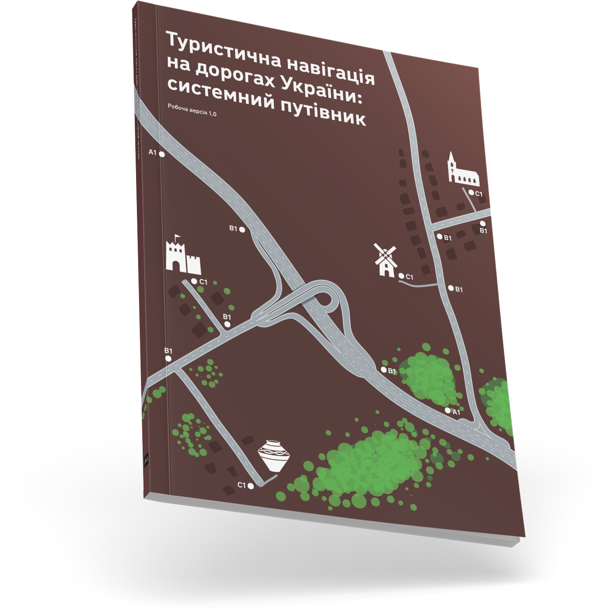

# Туристична навігація на дорогах України: системний путівник

<code class="caption highlight"><small>
  Робоча версія 1.0 від 31 грудня 2021 року
</small></code>

Туристична навігація на дорогах України на момент створення цього путівника фактично відсутня. Поодинокі неконсистентні знаки не утворюють системи, яка надавала би додаткової цінності водіям. Ми створили цей путівник, щоб змінити це. Він допомагатиме проєктувальникам розробляти туристичні знаки, що утворюватимуть передбачуваний, зрозумілий і корисний інформаційний шар. Таким чином ми допоможемо автомобілістам, які бажають відвідати нові для себе місця, робити приємні відкриття і пізнавати Україну. А тим, хто точно знають, що саме хочуть відвідати, допоможемо комфортно і безпечно дістатися цих місць.

  

    
  

  

    
Путівник можна завантажити у&nbsp;вигляді PDF.

    <a href="/PDF/TouristRoadSigns-Guide-v.1.0.pdf" target="_blank" style="font-weight: 700;">
      Завантажити
    </a>
    
PDF, 24 МБ

  

Положення, які ми описуємо в цьому путівнику, мають допомагати виробленню рішень. В ньому ми пропонуємо уніфікований підхід до ознакування окремих точок інтересу, туристичних маршрутів та туристичних населених пунктів.

Проте, реальність завжди складніша за модель, і кожна ситуація є певною мірою унікальною. Тому остаточний вибір та ухвалення рішення має завжди бути за спеціалістом. Маючи суттєві аргументи або зіштовхнувшись з нетиповою ситуацією, ви можете відхилятись від запропонованих тут рішень і правил та діяти на власний розсуд.

Це робоча версія посібника, й зворотній зв’язок радо приймається. Напишіть нам на адресу tourism@a3.kyiv.ua, якщо:
* під час роботи у вас виникли складнощі;
* ви побачили нестиковку чи нелогічність написаного;
* ви працюєте з ситуацією, яку не описано в посібнику;
* у вас є пропозиції, як покращити систему маршрутного орієнтування.

## Зміст

* [Розділ 1. Основні принципи](                     1-principles.md)
* [Розділ 2. Типи об’єктів](                        2-object-types)
  * [ 2.1 Точка інтересу](                          2-object-types?id=_)
  * [ 2.2 Туристичний маршрут](                     2-object-types?id=_)
  * [ 2.3 Туристичний населений пункт](             2-object-types?id=_)
  * [ 2.4 Сервіси](                                 2-object-types?id=_)
* [Розділ 3. Користувачі туристичної навігації](    3-users.md)
  * [ 3.1 Типи користувачів](                       3-users.md?id=_)
  * [ 3.2 Користувацький сценарій](                 3-users.md?id=_)
* [Розділ 4. Типи знаків](                          4-sign-types.md)
  * [ 4.1 Набір типових знаків](                    4-sign-types.md?id=_)
  * [ 4.2 Попередні знаки (тип A)](                 4-sign-types.md?id=_)
  * [ 4.3 Напрямні знаки (тип B)](                  4-sign-types.md?id=_)
  * [ 4.4 Підтверджувальні знаки (тип C)](          4-sign-types.md?id=_)
* [Розділ 5. Розміщення знаків](                    5-placement.md)
  * [ 5.1 Загальні рекомендації з розміщення](      5-placement.md?id=_)
  * [ 5.2 Попередні знаки (тип A)](                 5-placement.md?id=_)
  * [ 5.3 Напрямні знаки (тип B)](                  5-placement.md?id=_)
  * [ 5.4 Підтверджувальні знаки (тип C)](          5-placement.md?id=_)
* [Розділ 6. Елементи знаків](                      6-elements.md)
  * [ 6.1 Загальні принципи дизайну знаків](        6-elements.md?id=_)
  * [ 6.2 Кольори](                                 6-elements.md?id=_)
  * [ 6.3 Текст](                                   6-elements.md?id=_)
  * [ 6.4 Стрілки](                                 6-elements.md?id=_)
  * [ 6.5 Піктограми](                              6-elements.md?id=_)
  * [ 6.6 Номери доріг](                            6-elements.md?id=_)
  * [ 6.7 Позначення маршруту](                     6-elements.md?id=_)
  * [ 6.8 Облямівка та заокруглення кутів знака](   6-elements.md?id=_)
* [Розділ 7. Побудова знаків](                      7-construction.md)
  * [ 7.1 Попередні знаки (тип A)](                 7-construction.md?id=_)
  * [ 7.2 Напрямні знаки (тип B)](                  7-construction.md?id=_)
  * [ 7.3 Підтверджувальні знаки (тип C)](          7-construction.md?id=_)
* [Додаток А. Піктограми](                          appendix-a-icons.md)
  * [ І. Піктограми категорій](                     appendix-a-icons.md?id=_)
  * [ ІІ. Додаткові піктограми](                    appendix-a-icons.md?id=_)
  * [ ІІІ. Піктограми сервісів](                    appendix-a-icons.md?id=_)

## Для кого цей путівник

Насамперед, ми бачимо головним користувачем путівника зі створення туристичної дорожньої навігації проєктувальників схем організації дорожнього руху. Цей документ допоможе під час ознакування тої чи іншої ділянки дороги врахувати потреби автотуристів.

Обласні служби автомобільних доріг та профільні організації (Державна агенція розвитку туризму, туристичні асоціації тощо) можуть посприяти влаштуванню комплексних туристичних маршрутів та безперервному ознакуванню маршрутів до важливих об’єктів. Цей путівник допоможе їм підготувати доцільні та продумані пропозиції.

Місцеві громади та балансоутримувачі об’єктів можуть ініціювати процес встановлення знаків туристичної навігації й тим самим зробити важливі, на їхню думку, об’єкти відомішими та більш відвідуваними.

## Зв’язок з іншими документами

Цей путівник деталізує положення про дорожні знаки індивідуального проєктування, описані в ДСТУ 4100:2021 «Безпека дорожнього руху. Знаки дорожні. Загальні технічні умови. Правила застосування». Детально описаними типовими рішеннями та підходами, наочними ілюстраціями він допомагає проєктувальникам ефективніше та простіше впоратися з задачами ознакування.

Путівник зі створення туристичної дорожньої навігації також наслідує принципи, що ми заклали в документі «[Маршрутне орієнтування на дорогах України: системний путівник](http://roadguide.a3.kyiv.ua/)». Разом вони дають можливість створити комплексну і консистентну дорожню навігаційну систему, шари якої доповнюватимуть один одного.

Путівник також ґрунтується на вимогах Правил дорожнього руху України та не конфліктує з ними.

<!--  -->
<!--  -->

Путівник розробили «<a href="http://a3.kyiv.ua" target="_blank">Агенти змін</a>» на замовлення <a href="https://www.tourism.gov.ua/" target="_blank">Державного агентства розвитку туризму України</a> в 2021 році. Детальніше про хід проекту можна дізнатись <a href="//a3.kyiv.ua/projects/tourist-road-wayfinding">на сайті A3</a>.

Путівник слугує доповненням до ДСТУ 4100 та відповідає вимогам Конвенції про дорожні знаки і сигнали (Відень, 1968 р.)
і Європейської угоди, що доповнює цю Конвенцію.

Над проєктом працювали:
* Юрій Грановський 
* Роман Дима 
* Маргарита Заіменко
* Олександр Колодько 
* Олександр Зайцев 
* Олександр Клейменов

 

Ліцензія матеріалів — <a href="https://creativecommons.org/licenses/by-nd/4.0/deed.uk">CC BY-ND 4.0</a> — при використанні обов’язково вказувати авторів, можна копіювати, розповсюджувати та використовувати у комерційних цілях, заборонено модифікувати, продавати та обмежувати інших у використанні цих матеріалів. Всі матеріали розміщено на <a href="https://github.com/agentyzmin/tourist-road-sign-guide" target="_blank">Github</a>. Зроблено на Docsify.
